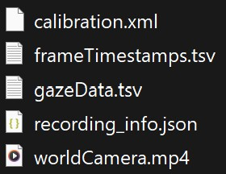
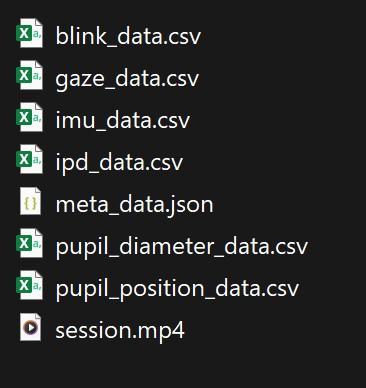

# glassesTools Documentation
  
`glassesTools` is a Python package for importing and preprocessing data from wearable eye-trackers. This package standardizes data handling for eye-tracking devices, making it compatible with analysis tools like `gazeMapper` and `glassesValidator`.
  
## Table of Contents
  
- [glassesTools Documentation](#glassestools-documentation )
  - [Table of Contents](#table-of-contents )
  - [Overview of glassesTools](#overview-of-glassestools )
  - [Package Integration](#package-integration )
    - [gazeMapper](#gazemapper )
    - [glassesValidator](#glassesvalidator )
  - [Installation](#installation )
  - [Supported Eye Trackers](#supported-eye-trackers )
  - [How It Works](#how-it-works )
  - [Usage Examples](#usage-examples )
    - [Importing Class](#importing-class )
      - [Example Usage](#example-usage )
  - [Known Issues and Troubleshooting](#known-issues-and-troubleshooting )
    - [Directory Requirements](#directory-requirements )
    - [Folder Structure](#folder-structure )
    - [Common Errors and Solutions](#common-errors-and-solutions )
    - [Cleaning the Output Directory](#cleaning-the-output-directory )
  
## Overview of glassesTools
  
`glassesTools` provides utilities to preprocess data from various eye-tracking devices, standardizing the data for analysis and validation in `gazeMapper` and `glassesValidator`.
  
## Package Integration
  
### gazeMapper
  
`gazeMapper` enables users to map world-based gaze data, synchronizing it across devices and cameras for spatial analyses on planar surfaces. This tool supports:
  
- **Mapping**: Converts eye-tracker coordinates into a common world view.
- **Synchronization**: Merges recordings from multiple devices.
- **Quality Metrics**: Generates metrics like accuracy and precision to evaluate the data quality.
  
### glassesValidator
  
`glassesValidator` supports real-time and post-recording data validation. Key features include:
  
1. **In-Recording Validation**: Using standardized protocols for immediate feedback.
2. **Post-Recording Processing**: Applies drift correction and quality control using a graphical interface.
  
Both tools depend on `glassesTools` for structured data input, streamlining data processing before analysis.
  
## Installation
  
To install `glassesTools` and `glassesValidator`, use pip:
  
```bash
python -m pip install glassesTools glassesValidator
```
  
> **Note**: `gazeMapper` cannot be installed via pip. Refer to the `gazeMapper` documentation for installation instructions.
  
## Supported Eye Trackers
  
| Device           | Enum Value                           |
|------------------|--------------------------------------|
| AdHawk MindLink  | `EyeTracker.AdHawk_MindLink`         |
| Pupil Core       | `EyeTracker.Pupil_Core`              |
| Pupil Invisible  | `EyeTracker.Pupil_Invisible`         |
| Pupil Neon       | `EyeTracker.Pupil_Neon`              |
| SeeTrue STONE    | `EyeTracker.SeeTrue_STONE`           |
| SMI ETG (1 and 2)| `EyeTracker.SMI_ETG`                 |
| Tobii Glasses 2  | `EyeTracker.Tobii_Glasses_2`         |
| Tobii Glasses 3  | `EyeTracker.Tobii_Glasses_3`         |
  
## How It Works
  
`glassesTools` processes raw eye-tracking data by:
  
1. **Reading Files**: Imports data files directly from the specified device directories.
2. **Standardizing Output**: Maps the data fields to a common structure, so the information aligns with `gazeMapper` and `glassesValidator` requirements.
3. **Storing Processed Data**: Writes structured data to an output directory, ensuring compatibility with the analysis tools.
  
This pipeline reduces the manual effort required to prepare eye-tracking data, allowing for a seamless transition to further analysis and validation.
  
## Usage Examples
  
### Importing Class
  
The primary class for importing data provides methods to retrieve recording information and process raw data files. Key functions include `get_recording_info` and device-specific import functions, such as `adhawk_mindlink()`.
  
#### Example Usage
  
Below is an example of using `adhawk_mindlink()`. Here, `output_dir` and `source_dir` are directories containing the input data and target output path. `rec_info` is the recording metadata, which provides essential details for processing.
  
```python
import glassesTools
  
source_dir = 'path/to/recording'
output_dir = 'path/to/output'
device = glassesTools.eyetracker.EyeTracker.AdHawk_MindLink
  
# Obtain recording information
rec_info = glassesTools.importing.get_recording_info(source_dir, device)
  
# Inspect rec_info for specific metadata
print(rec_info)
  
# Process the recording for AdHawk MindLink
glassesTools.importing.adhawk_mindlink(output_dir, source_dir, rec_info[0])
```
  
This script prepares the data for analysis in `gazeMapper` and `glassesValidator`, saving the output in a compatible format.
  
After processing the recording data, glassesTools generates structured files in output_dir for further analysis:
  

> **Note:** Note: This is the processed output generated by glassesTools, ready for use in analysis and validation tools like gazeMapper and glassesValidator.
  
## Known Issues and Troubleshooting
  
### Directory Requirements
  
Ensure that `output_dir` is empty before starting data processing. `pathlib.Path` is recommended for managing paths.
  
### Folder Structure
  
The directory containing the source data files (source_dir) should include all essential configuration files, such as .json files and raw data files specific to the device. Below is an example directory structure for data recorded via AdHawk MindLink:
  

  
> **Note**: This structure includes the essential files for a recording session with AdHawk MindLink. Ensure that similar files are present for other supported eye-tracking devices.
  
### Common Errors and Solutions
  
1. **Error: “Directory not found”**: Verify that `source_dir` and `output_dir` paths exist and are correctly referenced.
2. **Error: “File missing”**: Check that all required data files are in place and formatted according to the eye-tracker’s documentation.
  
### Cleaning the Output Directory
  
To clear `output_dir`, run:
  
```python
import shutil
from pathlib import Path
  
output_dir = Path('path/to/output')
if output_dir.exists() and any(output_dir.iterdir()):
    for item in output_dir.iterdir():
        if item.is_dir():
            shutil.rmtree(item)
        else:
            item.unlink()
```
  