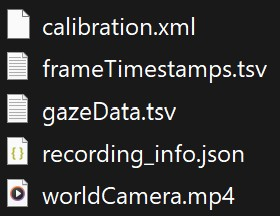
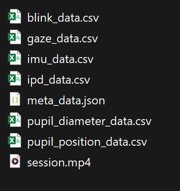

# glassesTools

GlassesTools have a [gitHub]() page and also a [Python Package Index (PyPI)]() page. For futher informations visit the pages.

## table of content

- [glassesTools](#glassestools)
  - [table of content](#table-of-content)
    - [Usage of glassesTools](#usage-of-glassestools)
    - [Remarks](#remarks)
    - [how to install](#how-to-install)
    - [Functions to use](#functions-to-use)
      - [glassesTools.importing-class](#glassestoolsimporting-class)
    - [issues with the the package glassesTools](#issues-with-the-the-package-glassestools)
      - [Directories](#directories)
        - [glassesTools.importing.adhawk\_mindlink()](#glassestoolsimportingadhawk_mindlink)
      - [folder structer](#folder-structer)
      - [output\_dir](#output_dir)
    - [idea of what to do next with the data](#idea-of-what-to-do-next-with-the-data)

### Usage of glassesTools

This package is intendent to prozes data of different wearables so that other python packages from the same project can analyse the data. The other two packages from the project are: gazeMapper and glassesValidator. The gazeMapper is for automated world-based analysis of wearables eye tracker data. Like: for automated mapping and processing of eye-tracking data to enable automated world-based analysis. gazeMapper can:

Transform head-centered data to one or multiple planar surfaces in the world.
Synchronize recordings from multiple participants, and external cameras.
Determine data quality measures, e.g., accuracy and precision using glassesValidator.

glassesValidator is about: 
The glassesValidator validation procedure consists of two parts, 1) a poster and validation procedure that is used during a recording, and 2) Python software for offline processing of the recording to estimate data quality measures. The glassesValidator package includes a graphical user interface (GUI) that can be used to perform all processing.

as a summary/main usage:
glassesTools: preparing the data
gazeMapper: mapping eye-tracking data
glassesValidator: data quality

### Remarks

The packages mentioned above have multiple issues so that it can't be used as it is now (glassesTools v1.12.5 gazeMapper v0.5.0 glassesValidator v2.0.5). the package glassesTolls works fine but you need to know a few things.
glassesValidator can only be downloades as a executible file and does not work to download via pip. For the gazeMapper you need to install it with the link from gitHub. Unfortunatly it is not clear on what you should do to achive the map with eye-tracking data.
Because there were some issues while testing the package galssesTools this documentation isn't just about what you can do what this packages. It is more like what are the problems you can get in touch with while using glassesTools. Unfortunatly it would be to much if i also include a hole documentation for the other two packages (glassesValidator and gazeMapper).

### how to install

Let's start installing glassesTools via pip. You can install it via the command `python -m pip install glassesTools` in the terminal. As i mentioned above one can use different eye-tracker. The one i used was the AdHawk MindLink. [Click here to get to the data from the example](). Here is a table for the different support for the eye-tracker:

|Name|`glassesTools.eyetracker.EyeTracker` `Enum` value|
| --- | --- |
|AdHawk MindLink|`EyeTracker.AdHawk_MindLink`|
|Pupil Core|`EyeTracker.Pupil_Core`|
|Pupil Invisible|`EyeTracker.Pupil_Invisible`|
|Pupil Neon|`EyeTracker.Pupil_Neon`|
|SeeTrue STONE|`EyeTracker.SeeTrue_STONE`|
|SMI ETG 1 and ETG 2|`EyeTracker.SMI_ETG`|
|Tobii Pro Glasses 2|`EyeTracker.Tobii_Glasses_2`|
|Tobii Pro Glasses 3|`EyeTracker.Tobii_Glasses_3`|

### Functions to use

The idea is that you write like `glassesTools.importing.get_recording_info(source_dir, glassesTools.eyetracker.AdHawk_MindLink)` with a source direction and an information about whicht eye-tracker you are using.
the common functions are: 

#### glassesTools.importing-class

Use glassestools.importing as a prefix to the other two functions below. 

|function|inputs|description|
| --- | --- | --- |
|`get_recording_info()`|<ol><li>[`source_dir`](#common-input-arguments)</li><li>`device`: `glassesTools.eyetracker.EyeTracker`</li></ol>|Determine if provided path contains a recording/recordings made with the specified eye tracker (`device`) and if so, get info about these recordings.|
|`adhawk_mindlink()`|<ol><li>[`output_dir`](#common-input-arguments)</li><li>[`source_dir`](#common-input-arguments)</li><li>[`rec_info`](#common-input-arguments): Optional</li><li>[`copy_scene_video`](#common-input-arguments): Optional, default `True`.</li><li>[`source_dir_as_relative_path`](#common-input-arguments): Optional, default `False`.</li><li>[`cam_cal_file`](#common-input-arguments): Optional. If not provided a default calibration provided by AdHawk is used.</li></ol>|Import an AdHawk MindLink recording to a subdirectory of `output_dir`. Does nothing if `source_dir` does not contain an AdHawk MindLink recording.|

After you used the function `glassesTools.importing.dhawk_mindlink()` you should have new files in you output directory. The other function is the glassestTools.importing.get_recording_info(source_dir, glassesTools.eyetracker.EyeTracker.AdHawk_MindLink) and for recivning the info you obviously need a `print()` function.
If everythin works your folder in the output_dir should look like this now:

*pic 1: The output from glassesTools.

### issues with the the package glassesTools

#### Directories

One should use `pathlib.path` but one can also use a regular path. I would suggest to use a raw string.

##### glassesTools.importing.adhawk_mindlink()

For this function you should use not the parameter from the documentation. It is important that you use an aditional information. the function should look like `glassesTools.importing.adhawk_mindlink(output_dir, source_dir, rec_info[0])`. For the rec_info just write `rec_info=(glassesTools.importing.get_recording_info(source_dir, glassesTools.eyetracker.EyeTracker.AdHawk_MindLink))` in your python file. The problem is that the package assume that the python file is in the a specific place in relation to the output_dir. The problem is about working direction/path to the file as we have discussed in class (topic pathlib). 

#### folder structer

Your folder with the eye-tracking data have to be like that:


*pic 2: folder structer from an take with the AdHawk MindLink glasses.*

If you copy the folder with the eye-tracking data make sure that there is e.g. the .json file. This file is very important because in this file there is the information on how the folder is structet.

#### output_dir

The folder needs to be empty else the package won't work. You can use the following code to clean the folder. So if the `glassesTools.importing.adhawk_mindlink()` and something gone wrong and the output isn't like it should (pic 2) you can use the following code to clean it up. So you can rerun your file and try again.

```python
if output_dir.exists() and any(output_dir.iterdir()):
    for item in output_dir.iterdir():
        if item.is_dir():
            shutil.rmtree(item)
        else:
            item.unlink()
```

Keep in mind that if you use this code you also need to import shutil.

### idea of what to do next with the data

The idea is that you can use the prozessed data for the other packages. The problem is that the other packages don't work really and don't have many functions.
