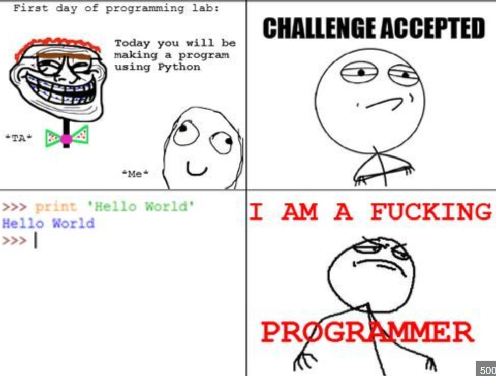

---

# Python Package

[Dokumentation](Eyetracking/docu_.md) für das Python-Paket. Eine allgemeine Information: Da diese Paketfamilie verschiedene Einschränkungen aufweist, sind die Möglichkeiten für eigenen Code begrenzt. Die Dokumentation der weiteren Pakete aus dieser Familie würde den Rahmen dieser Arbeit sprengen.

Für die Datenaufnahme gibt es zwei Optionen: Entweder auf bereits vorhandene Daten zurückgreifen ([Ältere Daten können hier abgerufen werden](Eyetracking/data/Guest_2024-11-04_184549)) oder eigene Daten aufnehmen. Falls du daran interessiert bist, einen Eyetracker auszuleihen, um eigene Daten zu sammeln, kontaktiere mich gerne – aktuell habe ich noch ein Gerät ausgeliehen (Stand: 14.11.2024). 
> **Aufgabe: Verarbeite die Daten mit *glassesTools*.**

[Für die Kontrolle des Python File hier klicken.](Eyetracking/glassesTL.py)

---

## Review von `shutil`

Meine Review der Dokumentation zu `shutil` findest du [hier](Documentations/peerreview_shutil.md).  
Meine Lösung zur Aufgabe steht [hier](<code/Aufgaben zur Verwendung von shutil.py>)zur Verfügung.

---

## Summary from the book

1. [chapter 1](wiki/chapter1.md)
2. [chapter 2](wiki/chapter2.md)
3. [chapter 3](wiki/chapter3.md)
4. [chapter 4](wiki/chapter4.md)
5. [chapter 5](wiki/chapter5.md)
6. [chapter 6](wiki/chapter6.md)

---

## PPT-Folien

* [Lecture 1 Introduction](docs/slides/001_Intro.pptx)
* [Lecture 2 Markdown and Git](docs/slides/002_Markdown_Git.pptx)
* [Lecture 3 KISS](docs/slides/003_Kiss.pptx)
* [Lecture 4 Sammeldatentypen](docs/slides/004_Testing_Sammeldatentypen.pptx)
* [Lecture 5 NumPy and PanDas](docs/slides/005_NumPy_pandas.pptx)

---

## Code Beispiele

### Woche 1

* [Hello World](code/hello_world.py)
* [Hexagon](code/hexagon.py)
* [Star](code/star.py)
* [Circle](code/circle.py)
* [Square](code/square.py)
* [Rectangle](code/rectangle.py)

### Woche 3

* [Jump](code/jump.py)

---

## Wiki

1. [Datentypen](wiki/001_datatypes.md)
2. [Variablen](wiki/002_variables.md)
3. [Operatoren](wiki/003_operators.md)
4. [Fehler](wiki/004_errors.md)
5. [Funktionen](wiki/101_functions.md)
6. [Bedingungen](wiki/102_conditions.md)
7. [Schleifen](wiki/103_loops.md)
8. [Sammel-Datentypen](wiki/104_collection-datatypes.md)
9. [Strings](wiki/105_strings.md)
10. [NumPy](wiki/201_numpy.md)
11. [Pandas](wiki/301_pandas.md)
12. [Plots](wiki/401_plots.md)
13. [Plotten: Beispiele und Variationen](wiki/402_plot_examples.md)

---

## Literatur / Referenzen

* [Link to the formatted text book](docs/lecture-book-sections/index.html)

---

## Bewertung

[Infos zur Bewertung](docs/bewertung.md)
