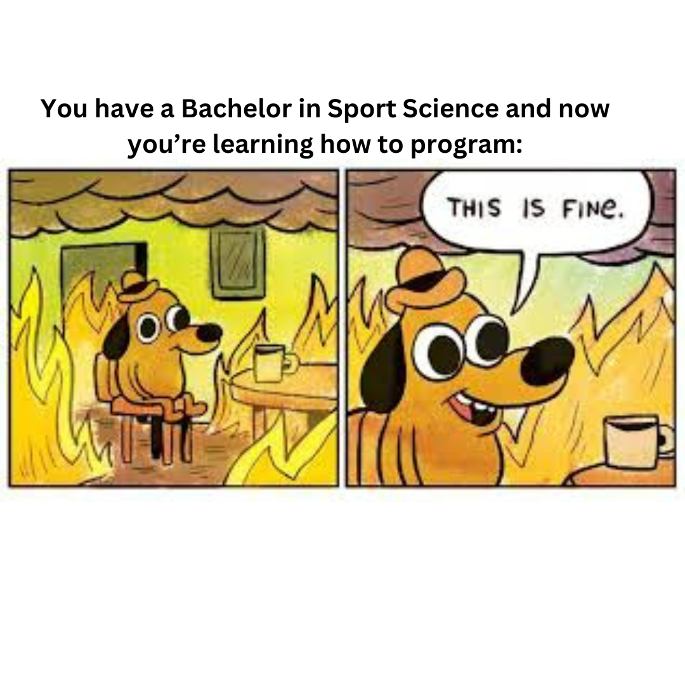

  

# Programming Basics - Johanna

### Python Pakete: Bericht und Review
>Alle Dateien zur Ausarbeitung meines eigenen Packages sowie das Review zu pyRserve finden sich unter: [python_packages](<python packages>).

- Das aufbereitete Python-Package `pyemgpipeline` befindet sich hier: [pyemgpipeline](<EMG Processing>).
- Das Peer-Review inkl. gelöste Aufgaben zu `pyRserve` ist hier aufzufinden: [pyRserve](pyRserve).

### Dokumentationen
*Dokumentationen der gelernten Inhalte haben auf unterschiedliche Art und Weise stattgefunden.* 

>Alle Dokumentationen finden sich hier: [notes](notes).

Die Inhalte des Seminars wurden urpsrünglich über die App Notability direkt auf den Vorlesungsfolien festgehalten und sind im folgenden Ordner zu finden:
[commented_slides](<notes/commented slides>).

&rarr;  [helpful_links](notes/helpful_links.md) enthält eine grobe Übersicht über diverse Inhalte, die in der Vorlesung behandelt wurden sowie nützliche Links, die tiefgründigere Informationen zu den einzelnen Themen bereitstellen.

&rarr; [py_beginner](notes/py_beginner.md) hält Erkenntnisse aus dem Microsoft-Learn-Path zum Einstieg in Python fest.  

&rarr; [howto_github](notes/howto_github.md) dokumentiert den beginnenden Umgang mit GitHub, erlernt mit dem dazugehörigen Microsoft-Learn-Path.

&rarr; [py_book](notes/py_book.md) beschreibt alle Erkenntnisse und Übungen aus dem Buch *Automate the boring stuff*.  

Im Ordner [coding_docu](<notes/coding docu>) finden sich alle Lehrbeispiele zum Programmieren, sowohl aus der Vorlesung als auch dem Buch *Automate the boring stuff*.