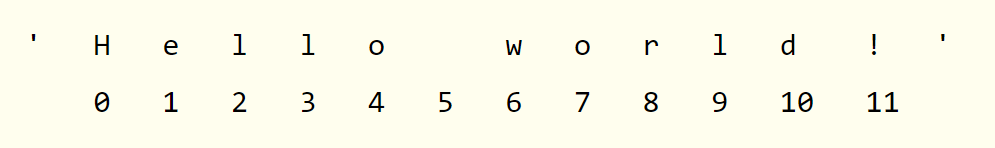
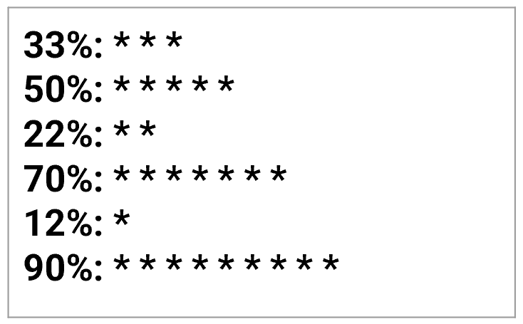
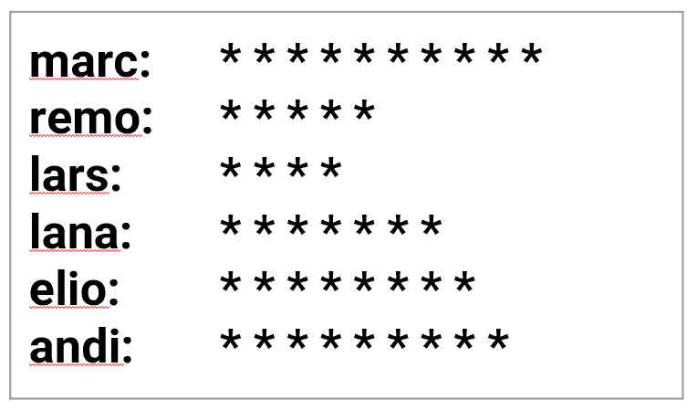

 Dokumentation zu Programming Basics

## Kapitel 1: Python Basics

### Interaktive Python Shell

Es gibt mehrere Varianten, wie man in Visual Studio Code die interkative Shell von Python nutzen kann. Die einfachste (für mich) ist über das Terminal, welches sich über den Reiter "Anzeigen" -> "Terminal" öffnen lässt. Gibt man darin den Befehl "python" ein, wird diese interaktive Shell gestartet. Zu erkennen ist dies and den drei Grösser-als-Zeichen ">>>". Die interaktive Shell kann verwendet werden, um schnell Code, bzw. dessen Ausgabe zu testen.

### Operationen in Python

Operatoren werden in Python verwendet um Berechnungen durchzuführen oder Bedingungen auszuwerten. Sie ermöglichen es uns, mathematische und logische Operationen zu implementieren, und umfassen unter anderem arithmetische, Vergleichs- und logische Operatoren.

Die wichtigsten Operatoren in Python, wie sie Text-Book aufgelistet sind:

| Operator | Operation                        | Beispiel                   | Ergebnis |
|----------|----------------------------------|----------------------------|-----------------|
| **       | Exponentialrechnung              | `2 ** 3`                   | 8               |
| %        | Modulus (Rest nach einer Divison)| `22 % 8`                   | 6               |
| //       | Integer Division                 | `22 // 8`                  | 2               |
| /        | Division                         | `22 / 8`                   | 2.75            |
| *        | Multiplikation                   | `3 * 5`                    | 15              |
| -        | Subtraktion                      | `5 - 2`                    | 3               |
| +        | Addition                         | `2 + 2`                    | 4               |

Bei einer komplizierteren Rechnung, mit mehreren Operatoren verfolgt Python die gleiche Logik wie in der Mathematik: Punkt vor Strich, bzw. Klammern vor Punkt vor Strich. Dazu ein Beispiel:

```py
rechnung1 = 5 + 5 * 5
print(rechnung1)

Output: 30

rechnung2 = (5 + 5) * 5
print(rechnung2)

Output: 50
```

### Datentypen in Python

In Python gibt es mehrere Datentypen, die unterschiedliche Eigenschaften haben. Die wichtigsten, wie sie im Text-Book stehen sind nachstehend wieder zusammengefasst:

| Datentyp                    | Abkürzung | Beispiele                                               |
|-----------------------------|-----------|--------------------------------------------------------|
| Ganzzahlen                  | int       | -2, -1, 0, 1, 2, 3, 4, 5                               |
| Kommazahlen            | float     | -1.25, -1.0, -0.5, 0.0, 0.5, 1.0, 1.25               |
| Zeichenketten (aka. Text)               | str       | 'a', 'aa', 'aaa', 'Hallo!', '11 Katzen'               |

Gerade diese Datentypen sind (am Anfang) immer wieder die Quelle für Fehler. Am Beispiel von vorhin kann das anschaulich dargestellt werden:

```py
beispiel1 = 5 + 5 * 5 
print(beispiel1) # Hier wird normal die Rechnung ausgeführt, weil Python mit Zahlen rechnet

Output: 30

beispiel2 = '5 + 5 * 5' 
print(beispiel2) # Durch das Hinzufügen von Anführungszeichen wird die Variable in Text (String/str) umgewandelt

Output: 5 + 5 * 5
```

Zwei String Variablen können mit dem '+'-Operator problemlos miteinander verbunden werden. Die Datentypen lassen sich jedoch nicht mischen. Dies in einem Beispiel:

```py
beispiel3 = 'Laura' + 'Martin'
print(beispiel3) 

Output: LauraMartin

beispiel4 = 'Laura' + 5 
print(beispiel4) 

Output: Errormeldung

beispiel5 = 'Laura' * 3 
print(beispiel5) 

Output: LauraLauraLaura
```
#### Datentyp einer Variablen bestimmen
Um den Datentyp einer Variable zu bestimmen, kann man die type()-Funktion verwenden. Diese Funktion gibt den Typ der übergebenen Variable zurück.

```py
x = 5
print(type(x))  # <class 'int'>
```

#### Umwandeln von Datentypen (casten)
Um eine Variable in den jeweiligen Datentyp umzuwandeln, kann die Abkürzug des Datentyps verwendet werden:

str(variable)

int(variable)

float(variable)

```py
alter = 29 # Eine Zahl wird standardmässig als Integer in einer Variable gespeichert, diese muss zuerst umgewandelt werden mit str().
print('Ich bin ' + str(alter) + ' Jahre alt.') # Wird der Befehl str() weggelassen, entsteht ein Error.

Output: Ich bin 29 Jahre alt.
```

Dieses Beispiel würde man in Python nie so coden, es veranschaulicht mir aber gut, worum es geht:

```py
alter = int(input("Wie alt bist du? "))
# Mit input wird eine User Eingabe gefordert. Diese wird mit dem vorhergehenden Befehl int() in eine Ganzzahl umgewandelt.
print("Du bist " + str(alter) + " Jahre alt.")
# Somit ist die Variable alter als Ganzzahl gespeichert, dadurch kann sie aber nicht mit Strings kombiniert werden. Damit das möglich ist, wird sie mit dem Befehl str() in einen String umgewandelt.
```

#### Spezialfälle

**None**
None ist in Python ein spezielles Schlüsselwort, das für „nichts“ oder „kein Wert“ steht. Es repräsentiert das Fehlen eines Werts oder eines „Null“-Zustands. None wird oft als Rückgabewert für Funktionen verwendet, die keinen expliziten Wert zurückgeben, und kann als Platzhalter genutzt werden, um auf das Fehlen von Daten hinzuweisen.

**nan**
nan steht für „Not a Number“ und wird in Python verwendet, um ungültige oder undefinierte numerische Werte darzustellen, oft bei Berechnungen mit Gleitkommazahlen (z. B. Division durch null). nan gehört zum float-Typ und wird in der Regel durch die Bibliotheken math und numpy definiert.


### Kommentare in Python

Wie oben zu sehen ist können Hashtags '#' verwendet werden um Kommentare in Python hinzuzufügen. Weil dieser Teil des Codes dann vom Compiler ignoriert wird, können Hashtags auch verwendet wurden um temporär Zeilen von Code auszukommentieren beim Testen von Ausführungen.

### Variablen in Python

In den vorangingen Beispielen wurden die ganze Zeit schon stillschweigend Variablen verwendet. Variablen werden verwendet, um Daten zu speichern, die später wiederverwendet werden. Variablen sind so intuitiv, dass sie nicht weiter beschrieben werden. Es folgend lediglich ein paar Beispiele: 

```py
name = 'Max'
alter = 22
grösse = 1.87
gewicht = 87
```

### Variablen Namen

Im Text-Boox werden einige Regeln aufgelistet zu Variablen Namen:

1. Variablen Namen dürfen nur ein Wort sein
1. Variablen Namen dürfen nur Buchstaben, Zahlen und Unterstriche enthalten
1. Variablen Namen dürfen nicht mit einer Zahl beginnen

Für meine eigene Klarstellung: mit einem Wort ist gemeint, dass kein Leerschlag dazwischen sein kann. So etwas wie 'jump_height' ist völlig okay, nicht aber 'jump height'.

### `print()` Funktion

Auch die Print Funktion wurde in einigen Beispielen schon verwendet. Sie wird benutzt, um Ausgaben in der Konsole anzuzeigen. 

### `input()` Funktion

Mit der Input FUnktion kann eine Eingabe des Benutzers angefordert werden. Diese muss dann mit der Eingabe Taste bestätigt werden. Hier ein Beispiel:


```python
name = input('Wie heisst du?: ') 
print('Schön dich zu sehen, ' + name)

Output: Schön dich zu sehen, Robin # Sofern oben der Name Robin eingegeben wurde ;)
```

### `len()` Funktion

Die len-Funktion in Python wird verwendet, um die Länge (Anzahl der Elemente) eines Objekts zu ermitteln. Sie funktioniert grundsätzlich mit verschiedenen Datentypen, vorläufig mal mit Strings. Auch dazu ein Beispiel: 

```py
text = 'Hallo'
print(len(text))  

Output: 5 # Das Wort "Hallo" entählt also 5 Buchstaben (Elemente).
```
Dieses Beispiel ist sehr trivial, es werden im Verlauf der Dokumentation weitere Beispiele dazu folgen.

## Kapitel 2: Flow Control

Mit Flow Control (auch Kontrollfluss genannt) in Python ist der Ablauf der Ausführung eines Programms gemeint. Sie bestimmt, in welcher Reihenfolge und unter welchen Bedingungen bestimmte Codeabschnitte ausgeführt werden. 

Das Schreiben des Codes und dessen Ausführung ist dabei erst der letzte Teilschritt beim Erarbeiten eines Programms. In einem ersten Schritt wird ein Plan des Programms erstellt, dies geschieht ausserhalb der Programmierumgebung. Dieser Plan wird Flowchart oder zu Deutsch Flussdiagramm genannt. 

Flowcharts werden verwendet, um den Ablauf eines Prozesses oder eines Algorithmus grafisch darzustellen. Sie helfen dabei, komplexe Abläufe verständlich zu visualisieren, indem sie einzelne Schritte und deren Abhängigkeiten in Form von Symbolen und Pfeilen zeigen.

Dazu ein Beispiel aus dem Text-Book:


Einfach ausgedrückt versucht ein Flowchart (auch UML-Diagramm genannt) das Problem zu skizzieren, mit seinen Teilschritten.

### Boolesche Operatoren


Boolesche Operatoren in Python werden verwendet, um logische Ausdrücke zu vergleichen und zu verknüpfen. Sie geben Wahrheitswerte aus, das heisst `true` oder `false`, basierend auf deren Bedingungen. Sie helfen, komplexe logische Ausdrücke zu formulieren und steuern den Ablauf von Entscheidungen im Code.

### Vergleichs Operatoren

Vergleichs Operatoren werden, wie der Name schon vermuten lässt, verwendet, um 2 Werte miteinander zu vergleichen. Aus diesem Vergleich entsteht schlussendlich ein Wert: entweder `true` oder `false`.

Die Vergleichs Operatoren, wie sie im Text-Book sind:

| Operator | Bedeutung                    |
|----------|------------------------------|
| ==       | Gleich                        |
| !=       | Ungleich                      |
| <        | Kleiner als                   |
| >        | Grösser als                    |
| <=       | Kleiner gleich           |
| >=       | Grösser gleich            |

Beispiele in Python:

```python
# Beispiel zu Vergleichsoperatoren in Python

a = 10
b = 20

# Gleichheit
print(a == b)  # False

# Ungleichheit
print(a != b)  # True

# Kleiner als
print(a < b)  # True

# Grösser als
print(a > b)  # False

# Kleiner oder gleich
print(a <= b)  # True

# Grösser oder gleich
print(a >= b)  # False
```

Wichtig festzuhalten ist noch, dass `"="` verwendet wird, um einer Variablen einen Wert zuzuweisen und `"=="` um zwei Werte miteinander zu vergleichen.


### `and`, `or` & `not`

`And`, `or` und `not` sind auch boolesche Operatoren, sie werden verwendet um logische Ausdrücke zu kombinieren. `And` gibt nur dann `true` zurück, wenn beide Operanden wahr sind, während `or` `true` zurückgibt, wenn mindestens einer der Operanden wahr ist. `Not` kehrt den Wahrheiswert eines Ausdrucks um, also wird `true` zu `false` und umgekehrt.

### Bedingte Anweisungen

Bedingte Anweisungen, auch Kontrollstrukturen genannt, ermöglichen es im Code Entscheidungen zu treffen. Dazu werden unterschiedliche Codeblöcke basierend auf bestimmten Bedingungen ausgeführt. Dazu werden in Python `if`, `else` und `elif` verwendet:

`if` prüft eine Bedingung, `elif` (steht für else if) bietet zusätzliche Bedingungen und `else` wird asugeführt, wenn keine der vorherigen Bedingungen zutraf. Dazu wieder Beispiele: 

```python
# Beispiel 1: if-Anweisung
x = 10
if x > 5:
    print("x ist grösser als 5")

# Beispiel 2: if-else-Anweisung
y = 3
if y > 5:
    print("y ist grösser als 5")
else:
    print("y ist kleiner oder gleich 5")

# Beispiel 3: if-elif-else-Anweisung
z = 7
if z > 10:
    print("z ist grösser als 10")
elif z == 7:
    print("z ist genau 7")
else:
    print("z ist kleiner als 10 und nicht 7")
```

### While Schleifen

While Bedingungen oder Schleifen werden in Python verwendet um einen Codeblock solange auszuführen (bzw. zu wiederholen), wie ein Statement wahr, also `true` ist. Sobald die Bedingung nicht mehr wahr ist, wird die Schleife beendet. Auch hier wieder ein Beispiel, das es viel besser erklärt:


```py
count = 1

while count <= 5:
    print(count)
    count += 1
```
Die Schleife wird beendet, sobald count 6 erreicht hat. 

Das Beispiel aus dem Textbook is ebenfalls sehr anschaulich, und ein bisschen lustig:

```py
name = ''
while name != 'your name':
        print('Please type your name.')
        name = input()
print('Thank you!')
```

Der Codeblock wird solange "please type your name" ausgeben, bis der User wirklich "your name" eingibt. Brilliant.

Mit den Befehlen "break" kann eine While Schleife unterbrochen werden, mit "continue" wird sie weiter ausgeführt, obwohl sie zu einem Ende gekommen ist.

### `for` Schleifen und die `range()` Funktion

While Schleifen werden ausgeführt solange ihre Bedingung wahr ist. For Schleifen sind ähnlich, hier kann aber festgelegt werden, wie viel mal sie ausgeführt werden sollen. Dies geschieht mit der `range()` funktion:

```py
for i in range(1, 6):
    print(i)

Output: 1, 2, 3, 4, 5
#!!6 ist ausgeschlossen!!
```

In for Schleifen mit range stehen in Klammern immer der Startpunkt, Endpunkt (der aber nicht inklusive ist) und das Intervall. 

Der Befehl `range(0, 10, 2)` fängt also bei 0 an und geht in 2er Schritten bis 10, wobei 10 aber eben nicht inklusive ist. Die Ausgabe wäre also:
0, 2, 4, 6, 8

## Kapitel 3: Funktionen

### Modularität

Das Prinzip der Modularität in Python bezieht sich auf das Zerlegen eines Programms in kleinere, unabhängig funktionierende Einheiten, sogenannte Module oder Funktionen. Anstatt ein grosses, unübersichtliches Programm zu schreiben, teilt man den Code in kleinere, spezifische Funktionen auf, die jeweils eine bestimmte Aufgabe erfüllen. Dieses VOrgehen bietet einige Vorteile, darunter bessere Lesbarkeit des Codes, Widerverwendbarkeit, Wartbarkeit und Testbarkeit.


In Python gibt es neben den Basic Funktionen wie `print()`, `input()` oder `len()`. In Python sind Funktionen wiederverwendbare Codeblöcke, die eine bestimmte Aufgabe ausführen. Funktionen helfen, den Code übersichtlicher zu gestalten und wiederholte Abläufe zu vermeiden.
Funktionen werden in Python immer mit dem Schlüsselwort `def` definiert. 

Es folgt wieder ein einfaches Beispiel einer Funktion:

```py
def addiere(a, b):
    return a + b

ergebnis = addiere(3, 5)
print(ergebnis)

Output: 8
```
### Scope

In Python bezieht sich der Scope (Gültigkeitsbereich) auf den Bereich des Codes, in dem eine Variable zugänglich ist. Es gibt zwei Hauptarten von Scope:

1. Local Scope:
- Variablen, die innerhalb einer Funktion definiert werden, befinden sich im local scope.
- Sie sind nur innerhalb der Funktion verfügbar und können ausserhalb der Funktion nicht verwendet werden.

```py
def meine_funktion():
    x = 10  # lokale Variable
    print(x)

meine_funktion()
# print(x) würde hier einen Fehler auslösen, weil x ausserhalb der Funktion nicht existiert
```

2. Global Scope:
- Variablen, die ausserhalb aller Funktionen definiert werden, befinden sich im global scope.
- Sie sind überall im Programm zugänglich, auch innerhalb von Funktionen (ausser wenn sie dort überschrieben werden).

```py
x = 10  # globale Variable

def meine_funktion():
    print(x)  # kann auf die globale Variable zugreifen

meine_funktion()  # Output: 10
print(x)  # Output: 10
```

**Unterschied:**

- Lokale Variablen existieren nur innerhalb der Funktion, in der sie definiert wurden.
- Globale Variablen können überall im Code verwendet werden, es sei denn, sie werden innerhalb einer Funktion überschrieben.


### Exception Handling

Im Text-Book wird in einem kurzen Abschnitt ein wichtiger Aspekt aufgegriffen: Exception Handling, zu Deutsch: Behandlung von Ausnahmen. Das Beispiel und die Erklärungen in Text-Book sind so gut, dass ich sie hier übernehmen werde.

Im folgenden Python Programm wird an einer Stelle durch 0 dividiert, was zu einem Error führt:

```py
def spam(divideBy):
    return 42 / divideBy
# hier wird eine Funktion "spam" definiert und ihr der Parameter "divideBy" zugeschrieben. Mit den print Befehlen unten wird für divideBy eine Zahl eingesetzt.

print(spam(2))
print(spam(12))
print(spam(0))
print(spam(1))

```

Folgender Ouput wird erzeugt in Python:

```py 
21.0
3.5
Traceback (most recent call last):
  File "C:/zeroDivide.py", line 6, in <module>
    print(spam(0))
  File "C:/zeroDivide.py", line 2, in spam
    return 42 / divideBy
ZeroDivisionError: division by zero
# das return statmement in spam(0) verursacht einen Error. 
```

Solche Fehlermeldungen kann man mit `try` und `except` statements in den Griff bekommen. Man schreibt dazu den Code um, wie folgt:

```py
def spam(divideBy):
    try:
        return 42 / divideBy
    except ZeroDivisionError:
        print('Error: Invalid argument.') # damit wird eine 'costum' fehlermeldung herausgegeben, ohne dass das programm crashed und nicht weiterläuft.

print(spam(2))
print(spam(12))
print(spam(0))
print(spam(1))
```

Damit sieht der Ouput so aus:

```py
21.0
3.5
Error: Invalid argument.
None
42.0
```

## Kapitel 4: Listen

Eine Liste in Python ist eine geordnete Sammlung von Elementen, die unter einem gemeinsamen Namen gespeichert werden. Diese Elemente können verschiedene Datentypen haben, wie Zahlen, Zeichenketten oder sogar andere Listen. Listen sind veränderbar, das heisst wir können sie nachträglich ändern, beispielsweise Elemente hinzufügen, entfernen oder ändern.

### Merkmale von Listen in Python:

- Listen werden mit eckigen Klammern erstellt: []
- Die Werte innerhalb einer Liste werden Items oder Elemente genannt
- Sie können beliebige Datentypen enthalten: [1, "Hallo", True]
- Elemente in einer Liste sind indiziert. Der erste Index ist 0.
- Listen sind veränderbar, d. h. du kannst Elemente ändern, hinzufügen oder entfernen.

Dazu wieder ein Beispiel:

```py
# Eine einfache Liste
meine_liste = [1, 2, 3, "Hallo", True]

# mit dem Befehl print(Name der Liste[Nummer des Elements]) kann dieses Element ausgegeben werden.
print(meine_liste[3])

Output: Hallo

# Mit dem Befehl .append können Items/Elemente hinzugefügt werden
meine_liste.append("Welt")
```

Um individuelle Werte aus der Liste zu erhalten, werden eckige Klammern verwendet nach folgendem Schema:

```py
NameDerListe[Wert] #Werte beginnen immer bei 0!
```
Eine Liste kann auch mehrere kleinere Listen enthalten. Der Umgang damit geschieht wie folgt:

```py
spam = [['cat', 'bat'], [10, 20, 30, 40, 50]]
# Der erste Index spricht die entsprechende Liste an und der Zweite Index das darin enthaltene Element. Wenn ich also 30 als Output erhalten will muss ich folgende Eingabe tätigen:
spam[0,2]
```
### Negative Indexe

Mit negativen Indexen können ebenfalls Elemente aus einer Liste abgerufen werden. Mit dem Wert -1 wird das letzte Element der Liste abgerufen, mit -2 das zweitletzte usw.

### Slices

Mit Slices (zu Deutsch Scheiben) können mehrere Elemente aus einer Liste gleichzeitig abgerufen werden. Dazu wird zwischen den Elementen ein Doppelpunkt gesetzt:

```py
meine_liste = ['Hund', 'Katze', 'Maus', 'Fuchs', 'Hirsch']

print(meine_liste[1:3])

Output: ['Katze', 'Maus']
# Mit der Ausgabe werden die Elemente 1 (also 'Katze') und 2 (also 'Maus')
```

### Elemente hinzufügen

In einer Liste können Elemente auch hinzugefügt werden. Einerseits wie angesprochen mit dem Befehl `.append`, dann wird das Element am Ende der Liste hinzugefügt. Alternativ gibt es auch diese Variante:

```py
meine_liste = ['Hund', 'Katze', 'Maus', 'Fuchs', 'Hirsch']

meine_liste[1]='Hamster'
#Mit diesem Befehl wird das erste Element in der Liste ersetzt durch 'Hamster'.
print(meine_liste)

Output: ['Hund', 'Hamster', 'Maus', 'Fuchs', 'Hirsch']
```

### Elemente löschen

So wie Elemente hinzugefügt werden können, können auch Elemente aus einer Liste gelöscht werden. Dies geschieht mit dem Befehl `del.`

```py
meine_liste = ['Hund', 'Katze', 'Maus', 'Fuchs', 'Hirsch']

del meine_liste[3]

print(meine_liste)

Output: ['Hund', 'Katze', 'Maus', 'Hirsch']
```

### in und not Operatoren für Listen

Mit den Befehlen `in` und `not kann geprüft werden, ob sich ein Element in der Liste befindet:

```py 
'howdy' in ['hello', 'hi', 'howdy', 'heyas']
True

spam = ['hello', 'hi', 'howdy', 'heyas']
'cat' in spam
False
```
### Einige nützliche Tricks beim Arbeiten mit Listen

Im Text-Book wir eine Reihe an nützlichen Tricks aufgeführt beim Arbeiten mit Listen. Diese möchte ich hier zum Nachschlagen festhalten:

#### Der multiple Assignment Trick

Mit diesem Trick können mehrere Variablen gleichzeitig den Werten in einer Liste hinzugefügt werden:

Anstatt diese Zeilen zu schreiben: 
```py
cat = ['fat', 'orange', 'loud']
size = cat[0]
color = cat[1]
disposition = cat[2]
```
Kann direkt folgende Variante gewählt werden:

```py
cat = ['fat', 'orange', 'loud']
size, color, disposition = cat
```
Dazu müssen jedoch die Anzahl Variablen und Werte in der Liste übereinstimmen, ansonsten entsteht ein Fehlercode in Python. 

#### Augmented Assignment Operators

Augmented Assignment Operators in Python sind spezielle Operatoren, die eine Kombination aus einer mathematischen Operation und einer Zuweisung darstellen. Sie werden verwendet, um den Wert einer Variablen zu ändern und gleichzeitig das Ergebnis der Operation zurück in die gleiche Variable zu speichern. Dies ist eine kompakte Schreibweise, die sowohl den Code kürzer als auch lesbarer macht.

Hier sind einige gängige Beispiele für solche Operatoren:

- `+=` (Addition und Zuweisung): `x += 5` ist gleichbedeutend mit `x = x + 5`
- `-=` (Subtraktion und Zuweisung): `x -= 3` ist gleichbedeutend mit `x = x - 3`
- `*=` (Multiplikation und Zuweisung): `x *= 2` ist gleichbedeutend mit `x = x * 2`
- `/=` (Division und Zuweisung): `x /= 4` ist gleichbedeutend mit `x = x / 4`
- `%=` (Modulo und Zuweisung): `x %= 7` ist gleichbedeutend mit `x = x % 7`


### Die `index()`-Methode

Die `index()`-Methode wird verwendet, um den Index des ersten Vorkommens eines bestimmten Elements in einer Liste zu finden. Wenn das Element nicht gefunden wird, löst sie einen `ValueError` aus.

Ein Beispiel in Python: 

```py
fruits = ['Apfel', 'Banane', 'Kirsche', 'Banane']
index_banane = fruits.index('Banane')

print(index_banane)

Output: 1
```

### Die `append()`- und `insert()`-Methode

Mit den Befehlen `append()` und `insert()` können Elemente einer Liste hinzugefügt werden. 

Mit `append()` wird das Element am Ende der Liste angehängt:

```py
fruits = ['Apfel', 'Banane', 'Kirsche']
fruits.append('Orange')

print(fruits)

Output: ['Apfel', 'Banane', 'Kirsche', 'Orange']
```

Mit `insert()` kann das Elemenent an einer bestimmten Position eingefügt werden:

```py
fruits = ['Apfel', 'Banane', 'Kirsche']
fruits.insert(1, 'Orange')

print(fruits)

Output: ['Apfel', 'Orange', 'Banane', 'Kirsche']
```

### Die `remove()`-Methode

Mit dem `remove()`-Befehl können Elemente aus einer Liste gelöscht werden:

```py
fruits = ['Apfel', 'Banane', 'Kirsche', 'Banane']
fruits.remove('Banane')

print(fruits)

Output: ['Apfel', 'Kirsche', 'Banane']
```

### Listen-ähnliche Typen: Strings und Tupel

Listen sind nicht die einzigen Datentypen, die geordnete Sequenzen von Werten darstellen. Zum Beispiel sind Strings und Listen ähnlich, wenn man einen String als "Liste" einzelner Textzeichen betrachtet. Viele Dinge, die man mit Listen machen kann, funktionieren auch mit Strings: Indexierung, Slicing, for-Schleifen, `len()`, sowie die Operatoren `in` und `not in`.

Beispiele:

```python
name = 'Zophie'
print(name[0])      # Output: 'Z'
print(name[-2])     # Output: 'i'
print(name[0:4])    # Output: 'Zoph'
print('Zo' in name) # Output: True
```

### Veränderbare und unveränderbare Datentypen

Listen sind veränderbar (mutable), das heisst, wir können ihre Werte verändern, Werte hinzugefügen oder entfernen. Im Gegensatz dazu sind Strings unveränderbar (immutable), das bedeutet, man kann ihren Inhalt nicht ändern.

```py
name = 'Zophie a cat'
name[7] = 'the'

Output ist ein Fehler: TypeError
```
Um einen String zu verändern, erstellt man einen neuen String durch Verkettung und Slicing. Dies gezeigt an einem Beispiel:

```py
name = 'Zophie a cat'
new_name = name[0:7] + 'the' + name[8:12]

print(new_name)
Ouput: 'Zophie the cat'
```

### Tupel
Tupel funktionieren nach dem gleichen Prinzip wie Listen, sie sind jedoch unveränderbar. Sie werden mit runden Klammern () statt eckigen Klammern [] definiert:

```py 
eggs = ('hello', 42, 0.5)

print(eggs[0])

Output: 'hello'

print(eggs[1:3])

Output: (42, 0.5)
```

## Kapitel 5: Dictionaries und Datenstrukturierung


`Dictionaries` sind ähnlich wie Listen eine Samllung von Werten. Im Gegensatz zu den Indizes für Listen können die indizes für Dictionaries viele verschiedene Datentypen verwenden, nicht nur ganze Zahlen. In Dictionaries werden dafür sogennannte **Schlüssel** / **keys** verwendet, diesme Schlüssel wird ein Wert zugeordnet. Dadurch ensteht ein Schlüssel-Wert-Paar.

### Eigenschaften von Dictionaries:
- **Unveränderliche Schlüssel**: Die Schlüssel in einem Dictionary müssen unveränderlich sein (z.B. Strings, Zahlen, Tupel). Listen können nicht als Schlüssel verwendet werden.
- **Veränderliche Werte**: Die Werte eines Dictionaries können beliebig veränderlich sein, d.h. sie können Listen, andere Dictionaries, Strings oder beliebige Objekte sein.
- **Ungeordnete Struktur**: Dictionaries sind ungeordnet, was bedeutet, dass die Reihenfolge der Einträge nicht garantiert ist.

### Erstellung eines Dictionaries:
Ein Dictionary wird mit geschweiften Klammern `{}` erstellt, wobei die Schlüssel und Werte durch Doppelpunkte getrennt und die Paare durch Kommata getrennt werden:

```python
person = {
    "Name": "Robert",
    "Alter": 32,
    "Beruf": "Architekt"
}
```

Im Text-Book wird ein sehr anschauliches Beispiel beschrieben, mit dem man sich das Geburtsdatum von Freunden merken kann. Dieses möchte ich hier gerne festhalten:

```py
birthdays = {'Alice': 'Apr 1', 'Bob': 'Dec 12', 'Carol': 'Mar 4'}
# Dies ist ein Dictionary, welches den jeweiligen Namen (Schlüssel) mit Geburtstagen (Werten) verknüpft.

while True:
    print('Enter a name: (blank to quit)')
    name = input()
    if name == '':
        break
    # Es wird eine Endlosschleife kreiert, die den Benutzer nach einem Namen fragt.
    # Wenn der Benutzer einen leeren String eingibt, wird die Schleife beendet.

    if name in birthdays:
        # Überprüft, ob der eingegebene Name bereits im Dictionary `birthdays` vorhanden ist.

        print(birthdays[name] + ' is the birthday of ' + name)
        # Wenn der Name gefunden wird, wird der entsprechende Geburtstag aus dem Dictionary abgerufen und ausgegeben.
    else:
        print('I do not have birthday information for ' + name)
        print('What is their birthday?')
        bday = input()
        # Wenn der Name nicht im Dictionary ist, wird der Benutzer nach dem Geburtstag der Person gefragt.
    
        birthdays[name] = bday
        # Der neue Name und der zugehörige Geburtstag werden dem Dictionary hinzugefügt.

        print('Birthday database updated.')
        # Eine Bestätigungs-Nachricht, dass der Dictionary aktualisiert wurde.
```

### Die Methoden `keys()`, `values()` und `items()`

Es gibt die Möglichkeit sich die Schlüssel, Werte und Schlüssel und Werte eines Dictionaries ausgeben zu lassen. Dazu werden die Befehle `keys()`, `values()` und `items()`verwendet. Die von diesen Methoden zurückgegebenen Werte werden in einer Art Liste aufgeführt, es handelt sich dabei jedoch um keine echten Listen: Sie können nicht verändert werden und besitzen keine `append()`-Methode. Diese Datentypen (**dict_keys**, **dict_values** und **dict_items**) können jedoch in `for`-Schleifen verwendet werden. Dies zeigt sich am Besten an Beispielen:

```python
spam = {'color': 'red', 'age': 42}

for v in spam.values():
        print(v)

Output: 
red
42


for k in spam.keys():
        print(k)

Output:
color
age

for i in spam.items():
        print(i)

Output:
('color', 'red')
('age', 42)
```

Um eine richtige Liste zu erhalten, müssen die Werte in eine Liste umgewandelt werden:

```py
spam = {'color': 'red', 'age': 42}
spam.keys()
# Die Methode 'keys()' gibt alle Schlüssel des Dictionaries 'spam' zurück.Allerdings gibt sie kein echtes Listenobjekt zurück, sondern ein 'dict_keys'-Objekt, das ähnlich wie eine Liste verwendet werden kann, z.B. in Schleifen.

# Zwischenzeitliche Ausgabe wäre:
# dict_keys(['color', 'age'])
# Dies zeigt, dass das 'dict_keys'-Objekt die beiden Schlüssel 'color' und 'age' enthält.

>>> list(spam.keys())
# Der Befehl 'list()' wird verwendet, um das 'dict_keys'-Objekt in eine echte Liste umzuwandeln.

Output:
['color', 'age']
# Das Ergebnis ist eine echte Liste, die nur die Schlüssel des Dictionaries enthält.
```

### Überprüfung der Inhalte eines Dictionaries

Mit den `in`und `not` Operatoren kann überprüft werden, ob ein Key oder ein Wert in einem Dictionary existiert. Dazu können beispielsweise folgende Abfragen in der interaktiven Shell in Visual Studio Code gemacht werden:

```py
>>> test = {'Ort': 'Bern', 'Quartier': 'Breitenrain'}
>>> 'Quartier' in test.keys()
True

>>> 'Bern' in test.values()
True

>>> 'Land' in test.keys()
False
```

### Die `get()`-Methode

Mit der `get()`-Methode können direkt der Schlüssel und der Wert aus einem Dictionary gezogen werden. Ausserdem kann ein Ausweichswert angegeben werden, falls der Key nicht existiert.

```py
>>> officeSupplies = {'pens': 10, 'notebooks': 3}
>>> 'I have ' + str(officeSupplies.get('notebooks', 0)) + ' notebooks.'
# 0 ist der Ausweichswert, der ausgegeben wird, wenn der Key 'notebooks' nicht im Dictionary sein sollte.
'I have 3 notebooks.'

>>> 'I have ' + str(officeSupplies.get('markers', 0)) + ' markers.'
# Hier wird der Ausweichswert 0 ausgegeben, weil 'markers' nicht im Dictionary vorkommt.
'I have 0 markers.'
```

### Die `setdefault()`-Methode 

Mit der `setdefault()`-Methode kann einem Key einen Wert zugewiesen werden, aber nur wenn dieser nicht schon einen Wert besitzt. Dies ist wiederum am besten an einem Beispiel erklärt:

```py
>>> person = {'name': 'Anna', 'age': 30}
>>> person.setdefault('city', 'Bern')
# Weil der Key 'city' im Dictionary noch nicht exisiert, wird er hinzugefügt und ihm der Wert 'Bern' zugewiesen.
>>> person

{'city': 'Bern', 'age': 30, 'name': 'Anna'}
# Dem Dictionary wurde der Key 'city' mit dem Wert 'Bern hinzugefügt.

>>> person.setdefault('city', 'Zurich')
# Wird jetzt versucht auf die gleiche Art dem Dictionary nochmals 'city' hinzuzufügen und der Wert 'Zurich', passiert aber nichts. Der Wert von 'city' wird auch nicht geändert. Wenn der Key schon exisitiert, hat die setdefault-Methode keinen Effekt. 

>>> person
{'city': 'Bern', 'age': 30, 'name': 'Anna'}
```

Im Text-Book wird wieder ein sehr anschauliches Beispiel beschrieben, welches ich hier gerne zum Nachschlagen festhalten möchte:

Die `setdefault()`-Methode ist eine praktische Abkürzung, um sicherzustellen, dass ein Schlüssel existiert. Hier ist ein kurzes Programm, das die Anzahl der Vorkommen jedes Buchstabens in einem String zählt:

```python
message = 'Es war ein heller kalter Tag im April, und die Uhren schlugen dreizehn.'
# Nachricht, deren Buchstaben gezählt werden sollen

count = {}
# Dictionary, das die Zählungen der Buchstaben speichert

for character in message:
    # Diese Schelife speichert die Zählung der Buchstaben und stellt sicher, dass der Buchstabe im Dictionary existiert, mit einem Standardwert von 0
    count.setdefault(character, 0)
    
    count[character] = count[character] + 1
    # Erhöht den Zähler für diesen Buchstaben um 1

print(count)
# Gibt die Zählungen aller Buchstaben aus

Output:
{' ': 13, ',': 1, '.': 1, 'A': 1, 'I': 1, 'a': 4, 'c': 3, 'b': 1, 'e': 5, 'd': 3, 'g': 2, 'i': 6, 'h': 3, 'k': 2, 'l': 3, 'o': 2, 'n': 4, 'p': 1, 's': 3, 'r': 5, 't': 6, 'w': 2, 'y': 1}
```

Der Output zeigt an, wie viel mal jeder Buchstabe in der Nachricht vorkommt: Leerschlag 13 Mal, 'A' 1 Mal usw.

Im Text-Book wurde ausserdem ein Beispiel gemacht für ein Tic-Tac-Toe Board, anhand von dem Datenstrukturen zur Repräsentation von Dingen im echten Leben erklärt wurden. Dieses Beispiel wird im Rahmen der Dokumentatin ausgelassen.

### Verschachtelte Dictionaries und Listen

Das Beispield es Tic-Tac-Toe Boards geht in die Richtung von verschachtelten Dictionaries und Listen. Um für kompliziertere Dinge ein Modell zu erstellen, wird es nötig sein Listen und Dictionaries innerhalb von anderen Listen und Dictionaries zu erstellen.Listen sind nützlich, um eine geordnete Reihe von Werten zu enthalten, und Wörterbücher sind nützlich, um Schlüssel mit Werten zu verknüpfen. Dieses Thema wird im Text-Book wieder anhand eines Beispiels erklärt. Im Beispiel geht es um ein Picknick und wer was dazu mitbringt. 

Die Funtkion `totalBrought()`kann diese Datenstruktur lesen und die Gesamtzahl der von allen Gästen mitgebrachten Gegenstände berechnen:

```py
allGuests = {'Alice': {'apples': 5, 'pretzels': 12},
             'Bob': {'ham sandwiches': 3, 'apples': 2},
             'Carol': {'cups': 3, 'apple pies': 1}}
# Hier sind Dictionaries innerhalb von anderen Dictionaries, die die jeweiligen Dinge beinhalten, die die Personen zum Picknick bringen.              

# Funktion, die die Gesamtanzahl eines bestimmten Items über alle Gäste hinweg berechnet
def totalBrought(guests, item):
    numBrought = 0
    # Schleife durch jeden Gast (k) und ihre mitgebrachten Items (v)
    for k, v in guests.items():
        # Addiere die Anzahl des gesuchten Items, falls es existiert, andernfalls 0
        numBrought = numBrought + v.get(item, 0)
    return numBrought

# Ausgabe der Gesamtanzahl der mitgebrachten Items für jedes Item
print('Number of things being brought:')
print(' - Apples         ' + str(totalBrought(allGuests, 'apples')))
print(' - Cups           ' + str(totalBrought(allGuests, 'cups')))
print(' - Cakes          ' + str(totalBrought(allGuests, 'cakes')))
print(' - Ham Sandwiches ' + str(totalBrought(allGuests, 'ham sandwiches')))
print(' - Apple Pies     ' + str(totalBrought(allGuests, 'apple pies')))

Output:
Number of things being brought:
- Apples 7
- Cups 3
- Cakes 0
- Ham Sandwiches 3
- Apple Pies 1
```

## Kapitel 6: Arbeiten mit Strings

Text (und damit Strings) ist einer der am häufigsten verwendeten Datentypen in Python. Deshalb ist der korrekte Umgang damit essenziell. 

Strings können grundsätzlich mit einfachen Anführungszeichen `'Beispieltext'` geschrieben werden. Dadurch können aber einige Probleme auftreten. Tritt in einem Textabschnitt nämlich ein solches Anführungszeichen auf, dann führt das zu Problemen in Python.

```py
print('Das ist Tim's Hut')
#Hier wird nur der Text "Das ist Tim" ausgegeben, die 3 einfachen Anführungszeichen verursachen ein Problem in Python.
```

Zum Glück gibt es mehrere Varianten wie Strings geschrieben werden können:
- mit einem Anführungszeichen `'Beispieltext1'`
- mit doppelten Anführungszeichen `"Beispieltext2"`
- Mehrezeilige Strings mit dreifachen Anführungszeichen `'''Beispieltext3'''/"""Beispieltext3"""`

### Escape characters

Ausserdem können mit sogenannten Escape characters Zeichen verwendet werden, die sonst nicht in Strings verwendet werden können. Dazu wird ein Backslash `\` benutzt.
Das Beispiel von vorhin kann also so gelöst werden:

```py
print('Das ist Tim\'s Hut')
# Dadurch stimmt der Ouput: Das ist Tim's Hut.
```
Escape-Sequenzen wie \' und \" ermöglichen es, Anführungszeichen innerhalb von Strings zu verwenden, ohne die String-Begrenzung zu stören.
Dazu gibt es eine Reihe von verschiedenen Escape characters, die nützlich sind:

| Escape-Sequenz   | Wird dargestellt als |
|------------------|----------------------|
| \'               | Einfaches Anführungszeichen |
| \"               | Doppelte Anführungszeichen |
| \t               | Tabulator             |
| \n               | Neue Zeile (Zeilenumbruch) |
| \\               | Rückwärtsschrägstrich |

### Rohstrings

Rohstrings (in Python mit r gekennzeichnet) interpretieren Escape-Sequenzen wie \n oder \t nicht, sondern behandeln sie als normale Zeichen.
Wie in diesem Beispiel dargestellt:

```py
text = r"Dies ist ein Rohstring, \n wird nicht als Zeilenumbruch behandelt"
```

### Mehrzeilige Kommentare

Mit 3 doppelten Anführungszeichen `"""` können mehrzeilige Kommentare in Python eingefügt werden.

```py
text = r"Dies ist ein Rohstring, \n wird nicht als Zeilenumbruch behandelt"

"""Dies ist ein mehrzeiliger Kommentar,
der nicht ausgegeben wird."""
```

### Indexierung und Slicing von Strings

Strings verwenden Indizes und Slices genauso wie Listen. 
Wir können uns den String `'Hello world!'` als Liste vorstellen, bei der jedes Zeichen im String einen entsprechenden Index hat:

Hier ein Beispiel, das absichtlich als Bild aus dem Text-Book eingefügt wurde:


Der Leerschlag und das Ausrufezeichen werden mitgezählt. Insgesamt sind es also 12 Zeichen, von Index 0 bis Index 11.

### Die `upper()`, `lower()`, `isupper()` und `islower()`-Methoden

Mit den Befehlen `upper()` und `lower()` kann ein String in Grossbuchstaben, bzw. Kleinbuchstaben umgewandelt werden.
Dazu wird der Variablenname verwendet und dann die entsprechende Variante dahinter gesetzt:

```py
test1 = 'mein name ist ben'
test1 = test1.upper()

print(test1)
Output:
MEIN NAME IST BEN

test2 = 'Mein Name ist Gwen'
test2 = test2.lower()

print(test2)
Output:
'mein name ist gwen'
```
**Beispiel: Verwendung von `upper()` und `lower()`**

Die Methoden `upper()` und `lower()` sind nützlich, wenn wir mit Benutzereingaben arbeiten, bei denen die Gross- und Kleinschreibung keine Rolle spielen soll.
Angenommen, wir möchten überprüfen, ob ein Benutzer "ja" eingibt, unabhängig davon, wie er es schreibt (z. B. "Ja", "JA", "jA", etc.). 

```py
antwort = input("Möchten Sie fortfahren? (ja/nein): ")

#Durch das konvertieren von antwort in Kleinbuchstaben mit .lower() können wir es leicht mit "ja" vergleichen.
if antwort.lower() == "ja":
    print("Fortfahren...")
else:
    print("Abbrechen...")
```

Die Methoden `islower()` und `isupper()` werden verwendet, um zu überprüfen,
ob alle Buchstaben in einem String entweder in Klein- oder Grossbuchstaben vorliegen.

**`islower()`**
`islower()` gibt `True` zurück, wenn alle alphabetischen Zeichen im String klein geschrieben sind.
Wenn es keine Buchstaben gibt oder der String gemischte Gross- und Kleinbuchstaben enthält, gibt es `False` zurück.

Beispiel:
```python
text = "hallo welt"
print(text.islower()) 

Output: True
```
**`isupper()`**
`isupper()` gibt `True` zurück, wenn alle alphabetischen Zeichen im String gross geschrieben sind.
Andernfalls gibt es `False` zurück.

Beispiel:
```py
text = "HALLO WELT"
print(text.isupper())

Output: True
```

### Die isX-String-Methoden

Neben `islower()` und `isupper()` gibt es mehrere String-Methoden, die mit "is" beginnen und einen booleschen Wert zurückgeben, der die Natur des Strings beschreibt. Hier sind einige gängige isX-Methoden:

- **`isalpha()`**: Gibt `True` zurück, wenn der String nur aus Buchstaben besteht und nicht leer ist.
- **`isalnum()`**: Gibt `True` zurück, wenn der String nur aus Buchstaben und Zahlen besteht und nicht leer ist.
- **`isdecimal()`**: Gibt `True` zurück, wenn der String nur aus Dezimalziffern besteht und nicht leer ist.
- **`isspace()`**: Gibt `True` zurück, wenn der String nur aus Leerzeichen, Tabs oder Zeilenumbrüchen besteht und nicht leer ist.
- **`istitle()`**: Gibt `True` zurück, wenn jedes Wort im String mit einem Grossbuchstaben beginnt und nur aus Kleinbuchstaben besteht.

Beispiele:
```py
print('hallo'.isalpha())       # True
print('hallo123'.isalnum())    # True
print('123'.isdecimal())       # True
print('   '.isspace())         # True
print('Das Ist Ein Titel'.istitle())  # True
```

Anwendung zur Eingabevalidierung:

Die isX-Methoden sind hilfreich, um Benutzereingaben zu validieren. Hier ein Beispiel, 
das den Benutzer wiederholt nach seinem Alter und einem neuen Passwort fragt, 
bis eine gültige Eingabe erfolgt:

```py
while True:
    print('Geben Sie Ihr Alter ein:')
    alter = input()
    if alter.isdecimal():
        break
    print('Bitte geben Sie eine Ganzzahl für Ihr Alter ein.')

while True:
    print('Wählen Sie ein neues Passwort (nur Buchstaben und Zahlen):')
    passwort = input()
    if passwort.isalnum():
        break
    print('Passwörter dürfen nur Buchstaben und Zahlen enthalten.')
```

### Die Methoden `startswith()` und `endswith()` für Strings

Die Methoden `startswith()` und `endswith()` geben `True` zurück, wenn der String, auf dem sie aufgerufen werden,
mit dem angegebenen String beginnt bzw. endet. Andernfalls geben sie `False` zurück.

Beispiele:

```python
print("supercode.py".endswith(".py"))                 # True
print("supercode.txt".endswith(".py"))                # False
print("12345".endswith("45"))      # True
print("12345".endswith("5"))       # True
print("12345".endswith("123"))     # False
```

### Die `join()` und `split()`-Methoden

Mit `join()` können Strings miteinander kombiniert werden, mit `split()` können  sie getrennt werden.

```python
# Verbindet eine Liste von Wörtern zu einem String mit Leerzeichen. Die einzelnen Elemente werden zusammengeführt.
woerter = ['Das', 'ist', 'ein', 'Test']
satz = ' '.join(woerter)

print(satz)

Output: "Das ist ein Test"
```

Am Platz des Leerzeichens vor `.join(woerter)` kann beliebig etwas eingefügt werden. Im Beispiel wurde ein Leerzeichen verwendet,
es kann aber auch ein Buchstabe sein, dieser wird aber zwischen jedem einzelnen Element ausgegeben. 
Wird also beispielsweise `'s'` eingefügt, sieht der Output so aus:

```python
# Verbindet eine Liste von Wörtern zu einem String mit Leerzeichen. Die einzelnen Elemente werden zusammengeführt.
woerter = ['Das', 'ist', 'ein', 'Test']
satz = 's'.join(woerter)

print(satz)

Output: "DassistseinsTest"
```

Die `split()`-Methode macht genau das umgekehrte:

```py
satz = "Das ist ein Test"
woerter = satz.split()

print(woerter)

Output: ['Das', 'ist', 'ein', 'Test']

# Zerlegt einen String anhand eines Kommas
daten = "Apfel,Banane,Kirsche"
fruechte = daten.split(',')

print(fruechte)

Output: ['Apfel', 'Banane', 'Kirsche']
```

### `rjust()`, `ljust()`, `center()`

**`rjust(width, fillchar)`**: Rechtsbündelt den String. In Klammern kann angegeben werden, mit wie vielen Zeichen und welchem der Abstand gefüllt wird,
sodass der String die angegebene Breite erreicht.

Beispiel:
```py
text = "Hallo"
print(text.rjust(10, '-'))

Output: 
-----Hallo
```

**`ljust(width, fillchar)`**: Linksbündelt den String. In Klammern kann angegeben werden, mit wie vielen Zeichen und welchem der Abstand gefüllt wird,
sodass der String die angegebene Breite erreicht.

Beispiel:
```py
text = "Hallo"
print(text.ljust(10, '-'))

Output: 
Hallo-----
```

**`center(width, fillchar)`**: Zentriert den String und füllt beide Seiten mit einem angegebenen Zeichen, sodass der String die angegebene Breite erreicht.

Beispiel:
```py
text = "Hallo"
print(text.center(10, '-'))

Output: 
--Hallo---
```

### `strip()`,`rstrip()` und `lstrip()`

Die drei Befehle `strip()`,`rstrip()` und `lstrip()` machen genau das umgekehrte von `rjust()`, `ljust()`, `center()` und löschen angegebene Zeichen oder Leerschläge. 

Beispiele:

```py
#strip()
text = "---Hallo---"
print(text.strip('-'))

Output: Hallo

#rstrip()
text = "---Hallo---"
print(text.rstrip('-'))

Output: ---Hallo

#lstrip()
text = "---Hallo---"
print(text.lstrip('-'))

Output: Hallo---
```

### Kopieren und Einfügen von Strings mit `pyperclip`

**`pyperclip.copy(text)`**: Kopiert den angegebenen String in die Zwischenablage.
Damit können wir den kopierten Text überall einfügen, wo das Einfügen von Text möglich ist.

Beispiel:
```py
import pyperclip
pyperclip.copy("Hallo, Welt!")
```

**`pyperclip.paste()`**: Fügt den aktuellen Inhalt der Zwischenablage ein und gibt diesen als String zurück.

Beispiel:
```py
import pyperclip
text = pyperclip.paste()
print(text)
```

Diese Funktionen sind praktisch, um automatisch Text zu kopieren oder aus der Zwischenablage zu holen.


## Übungen während den Lektionen

### 17.09.2024, Woche 1

In der ersten Woche haben wir Übungen gemacht, in denen wir einen Kreis, ein Hexagon und einen Stern in Python dargestellt haben. Dazu haben wir das Modul „turtle“ in Python verwendet, welches mit der Importanweisung „import turtle as t“ aufgerufen wird. Die Übungen in Python sahen wie folgt aus:

```py
# Hexagon 
import turtle as t
# Importanweisung zur graphsichen Darstellung

for i in range(6):
# Mit range(6) werden die sechs Ecken des Hexagons erezugt, t.forward() definiert eine Seitenlänge und t.right() den Winkel
    t.forward(100)
    t.right(60)

t.exitonclick()

#Stern
import turtle as t

for i in range(5):
# Der Stern besteht aus 5 "Ecken" die einen Winkel von 144 Grad besitzen.
    t.forward(100)
    t.right(144)

t.exitonclick()

# Kreis
import turtle as t

for i in range(360):
# Ein Kreis kann angenähert werden durch ein Vieleck mit ganz vielen Ecken, kleinen Seitenlängen und kleinen Winkeln.   
    t.forward(1)
    t.right(1)

t.exitonclick()
```

### 24.09.2024, Woche 2

In der zweiten Woche haben wir die Übung aus Woche 1 ergänzt mit einem Rechteck, das unterschiedliche Seitenlängen hat. Wir haben hierbei mit if und else Bedingungen gearbeitet, um die unterschiedlichen Seitenlängen zu erstellen.

```py 
# Rechteck
import turtle as t

for i in range(4):
    if i%2:
        t.forward(100)
    else:
        t.forward(50)
    t.right(90)

t.exitonclick()
```

### 01.10.2024, Woche 3

In der dritten Woche haben wir haben wir ein Skript erstellt, dass eine gerade Linie mit einem "Zick-Zack" (Sprung) erstellt. Dies geschah nach folgender Vorlage aus den Folien:


Dazu haben wir folgenden Code geschrieben:

```py
import turtle as t

# Definieren der jump-Funktion
def jump(jump_height=50):
    """Simulates a turtle jump by moving in a triangular path.

    Parameters
    -----------
    jump_height : int, optional
        The height of the jump in units (default is 50 units).

    Returns
    --------
        None
    """
    t.left(60)
    t.forward(jump_height)
    t.right(120)
    t.forward(jump_height)
    t.left(60)


for height in range(20,70,5):
    t.forward(5)
    jump(height) # unsere eigene jump-Funktion
    t.forward(5)

t.exitonclick()
```

### 08.10.2024, Woche 4

In Woche 4 haben wir versucht eine Visualisierung von Prozentzahlen zu coden. Dies geschah nach folgender Vorgabe in den Folien:



Der Code in Python dazu sah so aus:

```py
def visualize(percentage):
    """Visualizes the given percentage as asterisks for easier comparison.

    Parameters
    -----------
    percentage : int
        The percentage value to be visualized as asterisks. Each asterisk represents 10%.

    Returns
    --------
        None
    """
    print(f"{percentage}%: {'* ' * (percentage // 10)}") # integer divison durch 10, um eine zahl zwischen 1 und 10 zu erhalten

percentages = [33, 50, 22, 70, 12, 90]
for percentage in percentages:
    visualize(percentage)

Output:
33%: * * * 
50%: * * * * *         
22%: * * 
70%: * * * * * * *     
12%: * 
90%: * * * * * * * * * 
```

Zum Lösen dieser Aufgabe wurde eine Liste verwendet.

In einem zweiten Schritt wurde die Aufgabe erweitert, nach folgender Vorgabe:



Hierfür wurde dann ein Dictionary verwendet:

```py
from typing import *

def print_result(name: str,percentage: Union[int,float])-> None:
    """prints the name and the corresponding precentage value nicely formatted.

    Parameters
    -----------

    name: str, char
        name of the individual or test case to be displayed.

    percentage: int, float
        percentage score to be visualized as asterisks

    Returns
    --------

        none    
    """
    print(f"{name}: {'*'*(percentage//10)}")

successful_tests = {
    'Janis': 44,
    'Matthieu': 55,
    'Jonathan': 63,
    'Robin': 78,
    'Nicolas1': 72, # Werte können hier auch andere Datentypen annehmen, beispielsweise ein float also hier 72.8 Dazu muss dann oben "percentage" in einen integer umgewandelt werden, damit die integer division funktioniert. Dictionaries sind sehr flexibles, anders als Listen.
    'Eliane': 77,
    'Johanna': 82,
    'Nicolas2': 87,
    'Elias': 93, 
}

for name, percentage in successful_tests.items():
    print_result(name, percentage)

Output:
Janis: ****
Matthieu: *****  
Jonathan: ****** 
Robin: *******   
Nicolas1: *******
Eliane: *******  
Johanna: ********
Nicolas2: ********
Elias: *********
```

#### Python Packages

Ausserdem haben wir in Woche 4 Python Packages angeschaut, beispielhaft an art Python. 


 Pakete in Python sind Sammlungen von Modulen, die zusammengefasst sind, um bestimmte Funktionalitäten oder Bibliotheken bereitzustellen. Sie helfen dabei, Code zu strukturieren, wiederverwendbar zu machen und komplexe Anwendungen in kleinere, leichter handhabbare Teile zu unterteilen.

**Modul vs. Paket:**

- Ein Modul ist eine einzelne Python-Datei, die Funktionen, Klassen oder Variablen enthält.
- Ein Paket ist eine Sammlung von Modulen, oft in einem Verzeichnis organisiert, das auch eine spezielle Datei namens __init__.py enthält (früher obligatorisch), um das Verzeichnis als Paket zu kennzeichnen.

#### PyPi

PyPi (PyPi.org) ist ein Online Verzeichnis, das solche Python Pakete zur Verfügung stellt. Entwickler von Paketen können sie hier hochladen und User*innen können diese runterladen und nutzen. 

Zur Installation von Paketen wird Pip verwendet. Pip ist ein Paketmanager für Python, der es ermöglicht, externe Python-Pakete zu installieren, zu verwalten und zu aktualisieren. Mit Pip können wir die eben beschriebene Bibliothek von PyPi nutzen.

Die Installation eines Packages geschieht mit folgendem Befehl:

```py
pip install _paket-name_
```
Auf der Seite von PyPi können auf der jeweiligen Seite des Pakets der Name, bzw. der ganze Code zur Installation gefunden werden. Dazu einige Beispiele:

```py
pip install art # zur Installation von art python

pip install plotly # zur Installation von plotly

pip install pandas # zur Installation von pandas
```

### 15.10.2024, Woche 5

#### NumPy

NumPy (Numerical Python) ist eine leistungsstarke Bibliothek für numerische Berechnungen in Python und wird als Grundlage für viele datenwissenschaftliche und maschinelle Lernbibliotheken verwendet.

##### Arrays

In NumPy sind Arrays grundlegende Datenstrukturen, die ähnlich sind wie Listen in Python. Arrays sind aber speziell für numerische Berechnungen optimiert. Die Elemente in einem Array haben alle den gleichen Datentyp (z.B. Integer, Float etc.).

Der NumPy-Array-Datentyp wird als `ndarray` bezeichnet (steht für n-dimensional array). Es ist eine leistungsstarke Struktur, die effiziente Speicherung und Berechnung ermöglicht. Arrays in NumPy können beliebig viele Dimensionen haben (1D, 2D, 3D usw.), damit sind sie für viele verschiedene mathematische oder wissenschaftliche Berechnungen geeignet. 

Beispiel zur Erstellung eines Arrays:$

```py
import numpy as np

# Erstellen eines eindimensionalen Arrays (1D-Array)
array_1d = np.array([1, 2, 3, 4, 5])

print(array_1d)

Output:
[1 2 3 4 5]


# Erstellen eines zweidimensionalen Arrays (2D-Array)
array_2d = np.array([[1, 2, 3], [4, 5, 6]])

print(array_2d)

Output:
[[1 2 3]
 [4 5 6]]


# Erstellen eines dreidimensionalen Arrays (3D-Array)
array_3d = np.array([
    [[1, 2, 3], [4, 5, 6]], 
    [[7, 8, 9], [10, 11, 12]]
])

print(array_3d)

Output:
[[[ 1  2  3]
  [ 4  5  6]]

 [[ 7  8  9]
  [10 11 12]]]
```

##### Daten aus einem Array abfragen

Daten können aus einem NumPy-Array durch verschiedene Techniken abgefragt werden, wie Indexierung, Slicing und Bedingte Auswahl. Es folgen Beispiele zu den jeweiligen Varianten.

1. Indexierung
Mit der Indexierung können wir einzelne Elemente eines Arrays abfragen, indem wir die Positionen der Elemente angeben. Die Zählung in NumPy beginnt bei 0.

```py
import numpy as np

# Erstellen eines 2D-Arrays
array_2d = np.array([[10, 20, 30], [40, 50, 60], [70, 80, 90]])

# Zugriff auf ein bestimmtes Element
element = array_2d[1, 2]  # Element in der zweiten Zeile, dritte Spalte

print(element)

Output:
60
```

2. Slicing
Mit Slicing können wir Teile eines Arrays auswählen. Dies ist besonders nützlich, wenn wir eine bestimmte Zeile, Spalte oder einen Bereich von Elementen auswählen möchten. Die Syntax lautet array[start:stop], wobei start die Startposition und stop die Endposition (nicht eingeschlossen) ist.

```py
import numpy as np

array_2d = np.array([[10, 20, 30], [40, 50, 60], [70, 80, 90]])

# Zugriff auf die erste Zeile
first_row = array_2d[0, :]  # Alle Spalten in der ersten Zeile

# Zugriff auf die erste Spalte
first_column = array_2d[:, 0]  # Alle Zeilen in der ersten Spalte

# Zugriff auf einen Teilbereich
sub_array = array_2d[0:2, 1:3]  # Erste bis zweite Zeile, zweite bis dritte Spalte

print("First Row:", first_row)
Output: [10 20 30]
print("First Column:", first_column)
Output: [10 40 70]
print("Sub Array:", sub_array)
Output: [[20 30]
        [50 60]]
```

3. Bedingte Auswahl
Mit der bedingten Auswahl können wir Elemente auswählen, die bestimmte Bedingungen erfüllen. NumPy erlaubt es, logische Bedingungen direkt auf Arrays anzuwenden, um Elemente zu filtern.

```py
import numpy as np

array_2d = np.array([[10, 20, 30], [40, 50, 60], [70, 80, 90]])

# Abfragen aller Elemente grösser als 50
greater_than_50 = array_2d[array_2d > 50]

print(greater_than_50)

Output:
[60 70 80 90]
```

##### Rechnen mit Arrays
Mit NumPy-Arrays kann man einfach und effizient mathematische Berechnungen durchführen. Die Operationen werden dabei elementweise durchgeführt, was bedeutet, dass sie auf jedes einzelne Element des Arrays angewendet werden. Dabei können die normalen Operationen wie Addition, Subtraktion, Multiplikation und Division vorgenommen werden.  

```py
import numpy as np

# Erstellen zweier Arrays
array1 = np.array([1, 2, 3, 4])
array2 = np.array([5, 6, 7, 8])

# Addition
addition_result = array1 + array2
print(addition_result)  
Output: [6 8 10 12]

# Subtraktion
subtraction_result = array1 - array2
print(subtraction_result)  
Output: [-4 -4 -4 -4]

# Multiplikation
multiplication_result = array1 * array2
print(multiplication_result)
Output: [5 12 21 32]

# Division
division_result = array1 / array2
print(division_result) 
Output: [0.2 0.33333333 0.42857143 0.5]
```

### 22.10.2024, Woche 6

#### Pandas
Pandas ist eine leistungsstarke Python-Bibliothek zur Datenanalyse und -manipulation. Sie bietet Werkzeuge zur Arbeit mit strukturierten Daten, insbesondere durch die `DataFrame`-Struktur.

##### DataFrames
Ein `DataFrame` ist eine tabellenartige Datenstruktur in Pandas, die aus Zeilen und Spalten besteht. Es ist das Hauptobjekt zur Datenmanipulation und ermöglicht eine flexible Handhabung von Daten.

##### DataFrames erstellen
`DataFrames` Können aus einer Vielzahl verschiedener Quellen erstellt werden, darunter Listen, Dictionaries, NumPy-Arrays oder sogar CSV oder Excel-Dateien. 

```py
import pandas as pd

# Ein Dictionary erstellen, das die Daten für den DataFrame enthält
# Die Schlüssel "Name" und "Alter" werden die Spaltennamen im DataFrame
# Die Werte sind Listen, die die Daten für jede Spalte enthalten
data = {
    "Name": ["Anna", "Ben", "Chris"],  # Spalte "Name" mit drei Namen
    "Alter": [28, 24, 35]              # Spalte "Alter" mit den zugehörigen Alterswerten
}

# Einen DataFrame aus dem Dictionary "data" erstellen
# Pandas ordnet die Schlüssel des Dictionaries als Spaltennamen zu und
# die Listenwerte werden als Zeilenwerte in den entsprechenden Spalten eingefügt
df = pd.DataFrame(data)

# Ausgabe des DataFrames zur Kontrolle (optional)
print(df)
```

##### Index und Column


In einem Pandas DataFrame sind Index und Columns grundlegende Konzepte, die dabei helfen, Daten effizient zu organisieren und zu referenzieren.

**Index:** 
Der Index eines DataFrames bezeichnet die eindeutigen Zeilenbezeichner. Jeder Eintrag im Index entspricht einer Zeile im DataFrame. Standardmässig verwendet Pandas eine numerische Indexierung, beginnend bei 0. Der Index kann jedoch auch angepasst werden, um zum Beispiel eine bestimmte Spalte oder benutzerdefinierte Labels zu verwenden.

```py
import pandas as pd

# DataFrame mit Standard-Index erstellen
data = {
    "Name": ["Anna", "Ben", "Chris"],
    "Alter": [28, 24, 35]
}
df = pd.DataFrame(data)
print(df)

Output:
   Name  Alter
0  Anna     28
1   Ben     24
2  Chris    35
```

**Columns:**

Columns sind die Spaltenbezeichner des DataFrames. Sie beschreiben, welche Art von Daten in jeder Spalte enthalten ist, wie zum Beispiel "Name" oder "Alter" in den obigen Beispielen. Die Spaltennamen können direkt beim Erstellen des DataFrames festgelegt oder später geändert werden.


Zusammengefasst:
- Index: Identifiziert die Zeilen und kann angepasst werden, um die Lesbarkeit oder Organisation der Daten zu verbessern.
- Columns: Beschreiben den Inhalt der Spalten und lassen sich ebenso ändern, um die Daten leichter verständlich zu machen.

##### Daten abfragen und ändern

Daten abfragen: Mit df["Spalte"] oder df.loc[Zeile] können Spalten und Zeilen abgefragt werden.

```py
import pandas as pd

# Beispiel-Daten
data = {
    "Name": ["Anna", "Ben", "Chris"],
    "Alter": [28, 24, 35],
    "Stadt": ["Bern", "Zürich", "Luzern"]
}
df = pd.DataFrame(data)

# Zugriff auf eine einzelne Spalte
print(df["Name"])
Output: Spalte "Name"

# Zugriff auf mehrere Spalten
print(df[["Name", "Alter"]])
Output: Spalten "Name" und "Alter"


# Zugriff auf eine bestimmte Zeile mit `loc`
print(df.loc[0])  # Ausgabe: Zeile mit Index 0

# Zugriff auf bestimmte Zeilen und Spalten mit `loc`
print(df.loc[0:1, ["Name", "Stadt"]])  
Output: Erste bis zweite Zeile, nur Spalten "Name" und "Stadt"

# Zugriff auf eine bestimmte Zeile und Spalte mit `iloc`
print(df.iloc[1, 2])
Output: Element in der zweiten Zeile und dritten Spalte ("Zürich")
```

Daten ändern: Daten lassen sich direkt ändern oder mit Zuweisungen updaten, z. B. df["Spalte"] = Werte.

```py
# Ändern der gesamten Spalte "Stadt"
df["Stadt"] = ["Fribourg", "Basel", "Genf"]
print(df)

# Ändern eines bestimmten Werts
df.at[1, "Alter"] = 26  # Ändert das Alter von "Ben" auf 26
print(df)
```
##### Group By
Mit groupby() können Daten nach bestimmten Kategorien gruppiert und aggregiert werden.

```py
import pandas as pd

# Beispiel-Daten
data = {
    "Name": ["Anna", "Ben", "Chris", "Diana", "Eva", "Frank"],
    "Abteilung": ["Vertrieb", "Marketing", "Vertrieb", "IT", "IT", "Marketing"]
}

# DataFrame erstellen
df = pd.DataFrame(data)
print("Original DataFrame:")
print(df)

Output: 
   Name     Abteilung
0  Anna     Vertrieb
1   Ben     Marketing
2 Chris     Vertrieb
3 Diana     IT
4   Eva     IT
5 Frank     Marketing


# Gruppieren nach "Abteilung" und Anzahl der Personen zählen
abteilung_count = df.groupby("Abteilung")["Name"].count()
print("\nAnzahl der Personen pro Abteilung:")
print(abteilung_count)

Output:
Anzahl der Personen pro Abteilung:
Abteilung
IT          2
Marketing   2
Vertrieb    2
```

##### Pivot 
Mit pivot() können wir Daten in eine neue Struktur bringen, dabei werten Spaltenwerte als neue Indexebenen verwendet. 

##### Transpose
Mit `df.T`kann ein DataFrame transponiert werden, das heisst die Zeilen und Spalten werden vertauscht. 

##### Daten importieren
Pandas kann Daten aus verschiedenen Quellen importieren, wie CSV, Excel, SQL oder JSON. Die Funktion pd.read_csv("datei.csv") ist eine der häufigsten Importmethoden.

##### Tabellenbereiche
Bereiche innerhalb einer Datei (wie bestimmte Blätter oder Spalten in einer Excel-Datei) können mit Parametern wie `usecols` oder `sheet_name` ausgewählt werden.

##### Unbekannte Werte
Unbekannte oder fehlende Werte können beim Import als NaN markiert werden, indem man na_values verwendet.

```py
df = pd.read_csv("datei.csv", na_values=["?"])
```

##### Daten exportieren
Pandas ermöglicht das Exportieren eines DataFrames in verschiedene Formate, wie CSV, Excel oder JSON. Beispiel für den Export in eine CSV-Datei:

```py
df.to_csv("output.csv", index=False)
```
index=False sorgt dafür, dass der Index des DataFrames nicht mit in die CSV-Datei exportiert wird.

### 05.11.2024, Woche 7

#### Python Files
Pfad-Separatoren: Auf Windows und Unix-Systemen unterscheiden sich die Pfad-Separatoren (\ für Windows und / für Unix). Die Path-Klasse von pathlib vereinfacht die Arbeit mit Pfaden und sorgt für Kompatibilität.

Path zusammensetzen: Verwende Path('pfad', 'zum', 'ordner'), um Pfadteile plattformunabhängig zusammenzusetzen.

```py
from pathlib import Path
dir_name = Path('code/nhl_player_stats.py')  # ergibt: code/nhl_player_stats.py
```

Ordner abfragen:

```py
Path().cwd() gibt das aktuelle Arbeitsverzeichnis zurück.
Path().home() gibt das Benutzerverzeichnis zurück.
Path().home() / 'Documents' ergibt den Pfad zum Dokumentenordner (C:/Users/<user>/Documents auf Windows).
```

Dateipfad-Details:
```py
file_path.name: Name der Datei (z. B. vpn_01.csv).
file_path.stem: Dateiname ohne Endung (z. B. vpn_01).
file_path.suffix: Dateiendung (z. B. .csv).
file_path.parent: Übergeordneter Ordner des Pfades.
file_path.exists(): Prüft, ob der Pfad existiert.
file_path.is_file(): Prüft, ob der Pfad eine Datei ist.
file_path.is_dir(): Prüft, ob der Pfad ein Verzeichnis ist.
file_path.resolve(): Gibt den absoluten Pfad zurück.
```

Verzeichnisinhalte auflisten:
```py
dir_name.iterdir(): Generator für alle Elemente im Verzeichnis.
list(dir_name.iterdir()): Listet alle Elemente im Verzeichnis auf.
dir_name.glob('*.csv'): Generator für alle .csv-Dateien im Verzeichnis.
```

Dateien im Verzeichnis filtern:
```py
for file_name in dir_name.glob('*.csv'): Schleife über alle .csv-Dateien.
for item in dir_name.iterdir(): Schleife über alle Elemente im Verzeichnis.
```
Diese Methoden sind nützlich, um plattformübergreifend mit Dateipfaden zu arbeiten und Verzeichnisse sowie Dateien zu verwalten.

#### Plots

In Python werden Plots häufig mit der Bibliothek **Matplotlib** erstellt, die leistungsstarke und flexible Werkzeuge zur Visualisierung von Daten bietet. Hier sind die grundlegenden Elemente und Funktionen für das Erstellen und Anpassen von Plots.

```py
```py
import numpy as np
import matplotlib.pyplot as plt
import pandas as pd

series = pd.Series(3 * np.random.rand(4), index=["a", "b", "c", "d"], name="Klubmitglieder")


series.plot.pie(
        labels=["Frauen", "Männer", "Jugendliche", "Kinder"],
        colors=["r", "g", "b", "c"],
        autopct="%.2f",
        fontsize=20,
        figsize=(6, 6),
        )
plt.savefig("./media/pieplot.png")
plt.show()
````

```

##### Figure

Eine **Figure** ist das übergeordnete Objekt, das den gesamten Plot enthält. Es kann mehrere Achsen enthalten, was besonders für komplexe Darstellungen mit mehreren Unterplots nützlich ist.

##### Axes
Axes (Achsen) sind die Bereiche, in denen die Daten tatsächlich dargestellt werden. Jede Figure kann eine oder mehrere Axes enthalten.

##### Subplots
Mit Subplots können mehrere Axes in einer Figure angeordnet werden. Dies ist nützlich für die Darstellung mehrerer Diagramme in einem einzigen Bild.

```py
# Erstellen einer 2x2-Gitterstruktur mit Subplots
fig, axs = plt.subplots(2, 2)
axs[0, 0].plot([1, 2, 3], [4, 5, 6])
axs[0, 1].plot([1, 2, 3], [6, 5, 4])
axs[1, 0].plot([1, 2, 3], [5, 5, 5])
axs[1, 1].plot([1, 2, 3], [3, 4, 3])
```

##### Styles
Matplotlib bietet viele Möglichkeiten, das Aussehen eines Plots anzupassen.

##### Farbe
Die Farbe der Datenpunkte oder Linien kann mit dem Parameter color festgelegt werden.

```py
plt.plot([1, 2, 3], [4, 5, 6], color='green')  # Grüne Linie
```

##### Marker
Marker werden verwendet, um die Datenpunkte in einem Plot zu markieren. Beispiele sind 'o' für Kreise und '^' für Dreiecke.

```py
plt.plot([1, 2, 3], [4, 5, 6], marker='o')  # Kreise als Marker für die Datenpunkte
```

##### Legenden
Eine Legende wird verwendet, um die Bedeutung der dargestellten Datenreihen zu erklären. Diese wird automatisch generiert, wenn den Datenreihen Labels zugewiesen werden.

```py
plt.plot([1, 2, 3], [4, 5, 6], label='Reihe 1')
plt.plot([1, 2, 3], [6, 5, 4], label='Reihe 2')
plt.legend()  # Zeigt die Legende an
```

##### Export
Ein Plot kann in verschiedenen Formaten exportiert werden, wie PNG oder SVG. Dies erfolgt mit der Methode savefig().

```py
plt.plot([1, 2, 3], [4, 5, 6])
plt.savefig('plot.png', dpi=300)  # Exportiert den Plot als PNG mit 300 dpi
```

##### Formate (png, svg)

PNG: Ein verlustfreies Rasterformat, ideal für Bilder.

SVG: Ein vektorbasiertes Format, das für Skalierbarkeit und Web-Darstellungen gut geeignet ist.

| Eigenschaft | Beschreibung                                                                                                   | Beispiel                               |
|-------------|-----------------------------------------------------------------------------------------------------------------|----------------------------------------|
| `dpi`       | Auflösung des Bildes in dpi (dots per inch). Eine höhere dpi führt zu einer höheren Qualität des exportierten Bildes. | `plt.savefig('plot.png', dpi=300)`     |
| `figsize`   | Grösse der Figure in Zoll (`width`, `height`). Ermöglicht die Kontrolle der Abmessungen des Plots.              | `plt.figure(figsize=(10, 5))`          |
