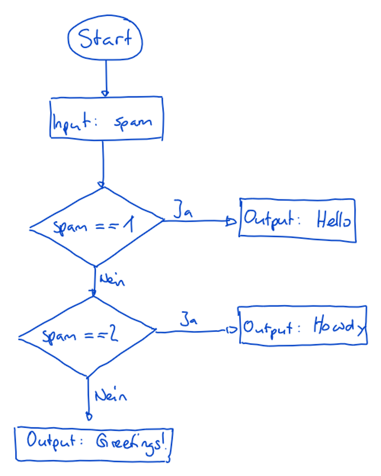
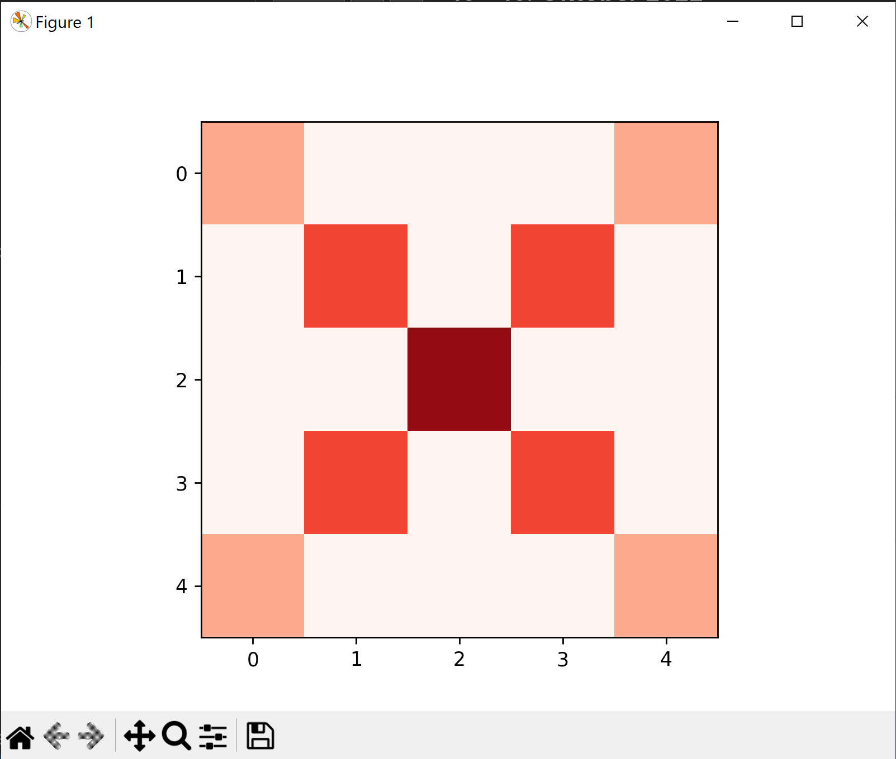

# Übungen Termin 3

## [lab_101_uml_to_code.py](lab_101_uml_to_code.py)

Schreibe ein Skript (unterhalb von `@exercise_uml`) welches nach dem untenstehenden Ablaufdiagramm funktioniert.



## [lab_102_loops.py](lab_102_loops.py)

Implementiere die Funktion `triangle(size)` zur Ausgabe eines Dreiecks.
Beispiele:

`triangle(1)`

```
*
```

`triangle(2)`

```
*
*   *
*
```

...

`triangle(5)`

```
*
*   *
*   *   *
*   *   *   *
*   *   *   *   *
*   *   *   *
*   *   *
*   *
*
```

**Tipp**: Unterteile das Problem in zwei Hälften: Zeichne zuerst das obere Dreieck, anschliessend das untere Dreieck.
**Knobelaufgabe**: Kannst du die Aufgabe mit einer einzigen `for`-Loop schreiben?

## [lab_103_collections.py](lab_103_collections.py)

1. Schreibe eine Funktion `summary`, welche als Argument eine Liste aufnimmt und anschliessend eine Zusammenfassung der Liste zurückgibt. Beispiel:

```py
summary([2, 5, 3, 7])
# => {
#       min: 2,
#       max: 7,
#       sum: 17,
#       length: 4,
#       mean: 4.25,
#       raw: [2, 5, 3, 7]
#    }
```

2. Du hast eine Liste von Listen, wobei jeder Wert der inneren Liste ein Zahlen-Wert zwischen 0 und 9 hat, etwa so:

```py
grid = [[3, 0, 0, 0, 3],
        [0, 6, 0, 6, 0],
        [0, 0, 9, 0, 0],
        [0, 6, 0, 6, 0],
        [3, 0, 0, 0, 3]]
```

`grid[row][column]` ist die Beschreibung für das Auffinden einer Zahl in der Zeile `row` und der Spalte `column` im oberen "Bild" aus Zahlen. Der Koordinaten-Ursprung `(0, 0)` liegt im Ecken **oben links**, die Zeile `row` geht mit zunehmender Grösse weiter nach unten, die Spalte `column` geht mit zunehmender Grösse weiter nach rechts.

Diese Liste kann als Bild ausgegeben und dargestellt werden, wobei für jede Zahl ein Quadrat mit roter Füllung gezeichnet wird, dessen Helligkeit mit den Zahlen `0-9` gesteuert werden kann. Folgende Funktion erzeugt die Ausgabe:

```py
draw_grid(grid)
```

Ausgabe:




### Aufgabe

In [lab_103_collections.py](./lab_103_collections.py) ist eine 2d-Liste `smiley` vorgegeben. Wenn dieses `smiley` mit `draw_grid(smiley)` ausgegeben wird, ist es leider um `90°` nach links verdreht. Implementiere die Funktion `draw_transposed_grid(grid)`, welcher eine 2d Liste als Funktionsparameter übergeben wird und diese um `90°` nach rechts dreht (daher Zeilen und Spalten vertauscht, wird auch `transpose` genannt). Funktioniert deine Funktion auch mit anderen 2d Listen? Überprüfe ob die Funktion richtig arbeitet, indem du die zweite gegebene 2d Liste `heart` übergibst.

## [lab_104_collatz.py](lab_104_collatz.py)

[Wikipedia](https://de.wikipedia.org/wiki/Collatz-Problem)

**a.)** Erstelle ein UML Diagramm für das _Collatz-Problem_:

- Beginne mit irgendeiner natürlichen Zahl `n > 0` und gib die Zahl aus
- Ist `n` gerade, so nimm als nächstes `n / 2`
- Ist `n` ungerade, so nimm als nächstes `3n + 1`
- Wiederhole die Vorgehensweise mit der erhaltenen Zahl.

Füge ein Foto des UMLs oder das Mermaid-Diagramm hier ein.


**b.)** Schreibe eine Funktion `collatz`, welche als Eingabe eine Zahl erhält und die nächste _Collatzzahl_ zurückgibt:

- Zahl ungerade: `3n + 1`
- Sonst: `n / 2`

**Beachte**: Der Typ einer Division ist stets Eine Gleitkommazahl (`float`), die zurückgegebene Collatzzahl soll aber eine natürliche Zahl (`int`) sein.

Welcher Teil des UML's deckt diese Funktion ab?

**c.)** Schreibe eine zweite Funktion `run`, welche den Benutzer nach einer ganzzahligen Eingabe fragt und eine Liste mit den Collatz-Zahlen zurückgibt.
Starte anschliessend mit dieser Zahl den unter _a.)_ beschriebenen Algorihmus, brich aber nach dem ersten Auftreten der Zahl `1` ab.

**d.)** Erweitere `run` so, dass es erst nach dem dritten Auftreten einer `1` abbricht, die letzten Zahlen der angezeigten Folge also `4, 2, 1, 4, 2, 1, 4, 2, 1` lauten.

## [lab_105_temperature.py](lab_105_temperature.py)

Schreibe ein Programm, das Temperaturen in verschiedene Skalensystemen ineinander umwandelt. Das Programm soll zu Beginn eine Auswahl mit den verschiedenen Möglichkeiten anbieten:

        (1) Umrechnung von Celsius nach Kelvin
        (2) Umrechnung von Celsius nach Fahrenheit
        (3) Umrechnung von Kelvin nach Celsius
        (4) Umrechnung von Kelvin nach Fahrenheit
        (5) Umrechnung von Fahrenheit nach Celsius
        (6) Umrechnung von Fahrenheit nach Kelvin

**Bemerkung**: Dies kann dir sicher helfen.

        Celsius = 5/9 * (Fahrenheit - 32).
        Celsius = Kelvin - 273.15.
        Die tiefste mögliche Temperatur ist der absolute Nullpunkt bei 0K.

### Vorgehen\*

\* nach jedem Schritt commiten

1. Schreibe Code, welcher den Benutzer danach fragt, welche Umrechnung er machen möchte (Text aus Beschreibung verwenden). Speichere die Entscheidung des Benutzers als `int` in einer Variable.

2. schreibe die Funktion `unit_input(selection)` welche basierend auf der Eingabe des Benutzers (Schritt 1) die Einzugebende Einheit zurückgibt.
   _Beispiel_: `unit_input(1)` => `'Celsius'`.
   Test `unit_input` sollte grün werden...

3. Schreibe Code, welche den Benutzer nach der umzuwandelnden Temperatur fragt und speichere die Eingabe als `float` in einer Variable. Benutze die eben geschrieben Funktion `unit_input()` um die richtige Einheit anzugeben.

_Bspw_. wenn Benutzer `1` gewählt hat: "Gib eine Temperatur in Celsius ein: "

3. Schreibe eine Funktion `celsius_to_kelvin(temperatur)` die von Celsius nach Kelvin umrechnet. Lasse die Tests laufen, dann commit und pushen.
4. Analog die Funktionen

- `kelvin_to_celsius(temperatur)`
- `celsius_to_fahrenheit(temperatur)`
- `fahrenheit_to_celsius(temperatur)`
  implementieren/testen/commiten/pushen.

5. Entscheide aufgrund der ersten Benutzereingabe (Schritt 1), welche Transformation aufgerufen werden soll. Speichere die Umgewandelte Temperatur in einer neuen Variable.

6. schreibe die Funktion `unit_output(selection)` welche basierend auf der Eingabe des Benutzers (Schritt 1) die Auszugebende Einheit zurückgibt.
   Beispiel: `unit_input(1)` => `'Kelvin'`.
   Test `unit_output` sollte grün werden...

7. Schreibe code, welcher das Resultat anzeigt:
   _Beispiel_ User hat `1` für `27`°Celsius gewählt: "27.0° Celsius ≅ 300.15° Kelvin"

8. Wenn noch nicht gemacht: Funktionen dokumentieren, commiten und pushen

**Tipp**: Wir haben keine Funktion für das Umrechnen von Kelvin zu Fahrenheit (bzw. umgekehrt) erstellt. Transformiere zuerst in eine andere Einheit, bevor du zu Fahrenheit umwandelst ;)
