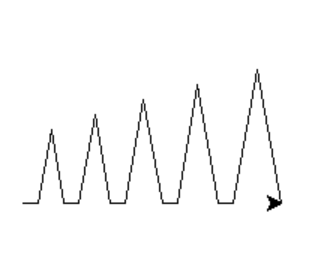
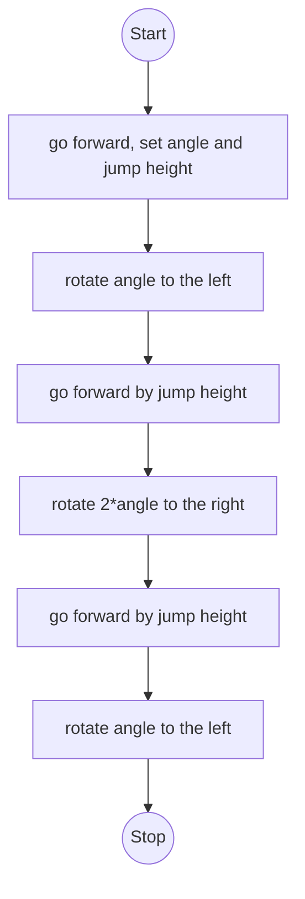

# Zackenfunktion
## Ziel
Ziel ist es, einen Sprung auszuführen und danach wieder in ursprünglicher Ausrichtung zu landen. Hierfür soll eine Funktion geschrieben werden, welche dann hintereinander mit unterschiedlichen Sprunghöhen und Winkeln ausgeführt werden kann. Das soll dann folgendermassen aussehen:



## UML



## Python-Code
```py
#import turtle
from turtle import forward, right, exitonclick

def jump(angle:float , height:float):
    """
    Generate spikes with a given angle and height

    Parameters
    ----------

    angle: float
        the angle of the spike
    height: float
        the height of the spike

    Returns
    -------
    None
    """
    right(-angle)
    forward(height)
    right(2*angle) #=180-2*(90-angle)
    forward(height)
    right(-angle)
 
#generate 5 spikes, which are getting bigger
for i in range(50,100,10):
    forward(10)
    jump(80,i)

exitonclick()
```