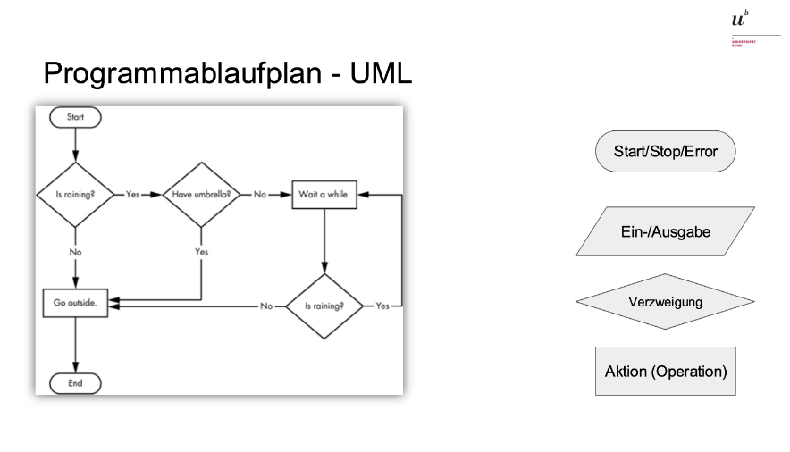

# UML
This is a short summary of the very basics of programming. It is mostly about unified modeling language. This is vital for creating a concept in programming. it is also usefull when you want to show your idea to an other programer.  

## Algorithm
A unique set of instructions made up of a finite number of well-defined individual steps, designed to solve a problem or a class of problems.
Computer programs follow these instructions.
## Program
A (computer) program is a sequence of instructions that adhere to the rules of a specific programming language, consisting of declarations and instructions, to handle or solve particular functions, tasks, or problems using a computer.
## UML:
 UML, or Unified Modeling Language, provides a standardized way to visually represent the algorithms and programs within a software system. Think of UML as a toolkit that allows developers to design the algorithmic flow and program structure before any code is written.
 

### KISS
Before we start with examples for UML's, always keep one concpet in mind:

**KEEP IT SIMPLE and STUPID**

### Beispiele für UML's
#### Stern und Neue Zeile ausgeben
- Aufgabe
	
	 
- UML Lösung
	
	 
#### Stern und Neue Zeile ausgeben
- Aufgabe
  
	
- UML Lösung

	

#### Für eine gegebene Zahl ebensoviele Sterne ausgeben
- Aufgabe
	 
	
- UML Lösung
	 
	
#### Für eine gegebene Zahl ebensoviele Sterne ausgeben
- Aufgabe

	
- UML Lösung

	

### Mermaid
Mermaid is a website where you can create UML's very easily. And also with the Mermaid Plugin you can create does in Visual Studio Code

 

