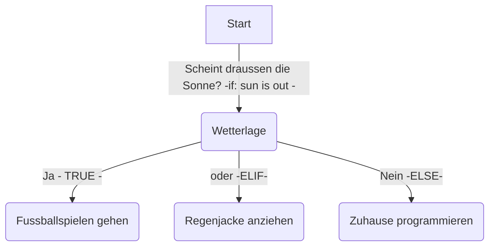

# Bedingungen
Auf Python können zwei Arten von Ausdrücken verwendet werden:
- Vergleichsoperatoren
- Binäre boolische Ausdrücke

Weitere Angaben zu den beiden Ausdrücken sind im Markdown Dokument '003_operators.md' ersichtlich.

[Logische Operatoren](003_operatoren.md#logische-operatoren)


## Wenn-Dann (`if`)
Die `if` Anweisung  wird verwendet, um Bedingungen zu überprüfen und Code auszuführen, wenn die Bedingung wahr (True) ist.


## Wenn-Dann-Sonst (`if else`)
Die `else` Anweisung wird ausgeführt, wenn die Bedingung in if nicht wahr ist.


## Geschachtelte Wenn-Dann-Sonst Überprüfungen (`if elif ... else`)
Mit elif können mehrere Bedingungen überprüft werden.

Beispiel für UML:



Code für Python:
```python
sun = 1
if sun == 1:
    print ("Fussballspielen")
elif sun == 2:
    print ("Regenjacke anziehen")
else:
    print (Zuhause programmieren)
```
