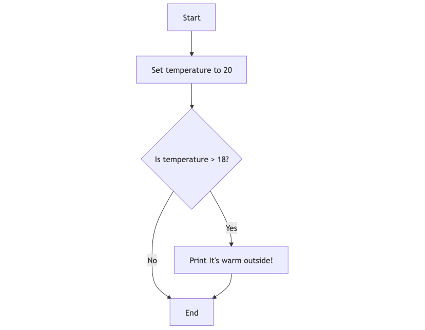
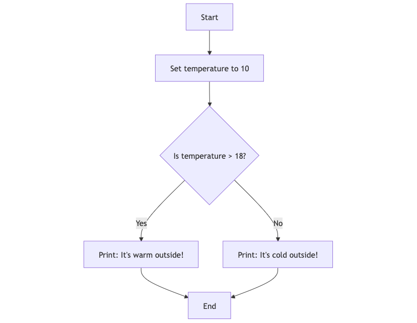

# Conditions

Conditions are used to execute code based on whether a statement evaluates to `True` or `False`.

- **What expressions can be used for conditions?**
  Conditions often use comparison and logical expressions, such as `==`, `<`, `>`, `and`, `or`, and `not`.
  
- **What is the data type of these expressions' results?**
  The result is typically of the Boolean data type: `True` or `False`.

For more on operators, refer to:
- [Comparison Operators](003_operators.md#comparison-operators)
-  [Logical Operators](003_operators.md#logical-operators)


## If Statement (`if`)

An `if` statement in Python checks a condition and executes the block of code indented under it only if the condition is `True`.

### UML Diagram for If Statement



### Python Implementation

```python
temperature = 20
if temperature > 18:
    print("It's warm outside!")
```

In this example, if the value of `temperature` is greater than 18, the message will be printed. If `temperature` is 18 or below, nothing will happen.

## If-Else Statement (`if else`)

An `if else` statement is used when you want to execute one block of code if a condition is `True` and another block if it is `False`.

### UML Diagram for If-Else Statement



### Python Implementation

```python
temperature = 10
if temperature > 18:
    print("It's warm outside!")
else:
    print("It's cold outside!")
```

In this example, if `temperature` is greater than 18, it prints "It's warm outside!". If not, it prints "It's cold outside!".

## Nested If-Else Checks (`if elif ... else`)

In cases where there are multiple conditions to check, you can use `if`, `elif`, and `else` statements to create complex conditional logic.

### UML Diagram for Nested If-Else Checks


### Python Implementation

```python
temperature = 15
if temperature > 25:
    print("It's hot outside!")
elif temperature > 18:
    print("It's warm outside!")
elif temperature > 10:
    print("It's cool outside!")
else:
    print("It's cold outside!")
```

In this example:
- If `temperature` is above 25, it prints "It's hot outside!".
- If `temperature` is between 19 and 25, it prints "It's warm outside!".
- If `temperature` is between 11 and 18, it prints "It's cool outside!".
- For any other value, it prints "It's cold outside!".

Using nested conditions allows for more flexibility and control in the logic of your program, helping you handle multiple scenarios in an organized manner.

