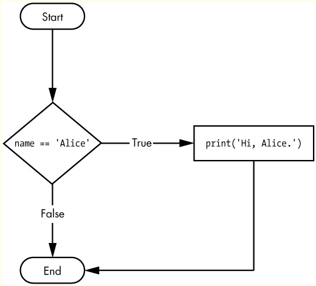
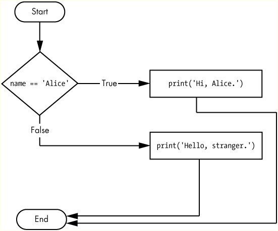
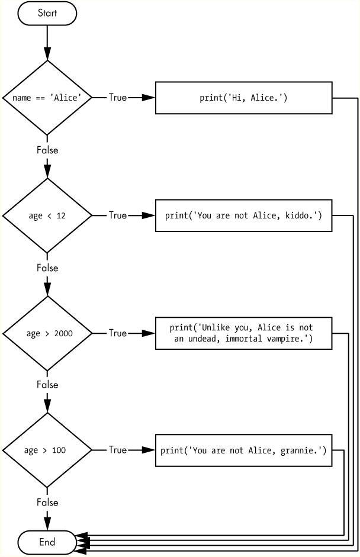

**Table of content**
- [Conditions](#conditions)
  - [Basic Conditions](#basic-conditions)
  - [If Statements](#if-statements)
  - [Else Statement](#else-statement)
  - [Elif Statement](#elif-statement)
  - [Combining Conditions](#combining-conditions)
  - [Nested Conditions](#nested-conditions)

# Conditions

Condition is just a more specific name in the context of flow control statements. Conditions always evaluate down to a [Boolean Values](001_datatypes.md#boolean-values), True or False. A flow control statement decides what to do based on whether its condition is True or False, and almost every flow control statement uses a condition.

They are a fundamental part of controlling the flow of a program, allowing you to execute certain pieces of code only when specific conditions are met. 
## Basic Conditions
A condition in Python is typically a comparison between two values. You can compare numbers, strings, or even complex data structures using various comparison operators:
[Comparison Operators](003_operators.md#comparison-operators)


## If Statements


An if statement allows you to execute a block of code only when a specified condition is true.
```py
if name == 'Alice':
    print('Hi, Alice.')
```


## Else Statement


An `else` statement provides an alternative block of code that runs if the condition in the `if` statement is False.
```py
x = 5
if name == 'Alice':
              print('Hi, Alice.')
          else:
              print('Hello, stranger.')
```

## Elif Statement


The `elif` (short for "else if") statement allows you to check multiple conditions. If the first `if` condition is false, the elif condition is checked, and so on.
```py
if name == 'Alice':
    print('Hi, Alice.')
elif age < 12:
    print('You are not Alice, kiddo.')
elif age > 2000:
    print('Unlike you, Alice is not an undead, immortal vampire.')
elif age > 100:
    print('You are not Alice, grannie.')
```

## Combining Conditions
You can combine multiple conditions using logical operators like and, or, and not:
- `and`: Both conditions must be true.
- `or`: At least one condition must be true.
- `not`: Negates the condition.
```py
x = 8
if x > 5 and x < 10:
    print("x is between 5 and 10")  # This will print

x = 12
if x < 5 or x > 10:
    print("x is either less than 5 or greater than 10")  # This will print

x = 3
if not x > 5:
    print("x is not greater than 5")  # This will print

```
## Nested Conditions
You can also nest `if`, `else`, and `elif` statements to check conditions within conditions.
```py
x = 15
if x > 10:
    if x < 20:
        print("x is greater than 10 but less than 20")  # This will print
```
