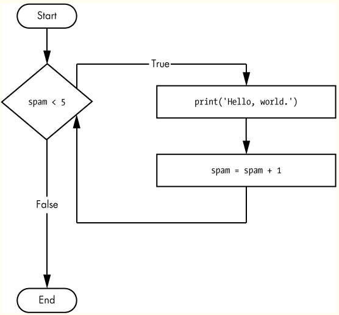
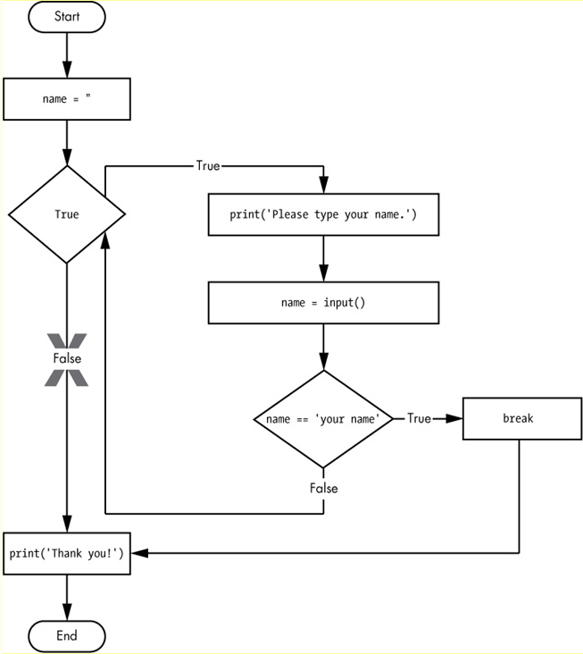
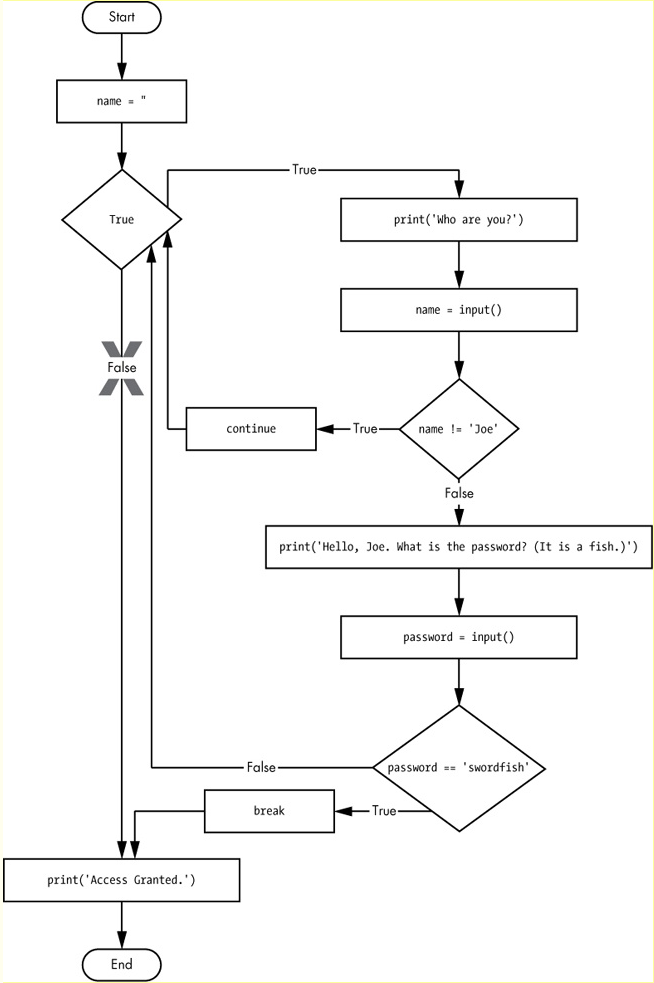
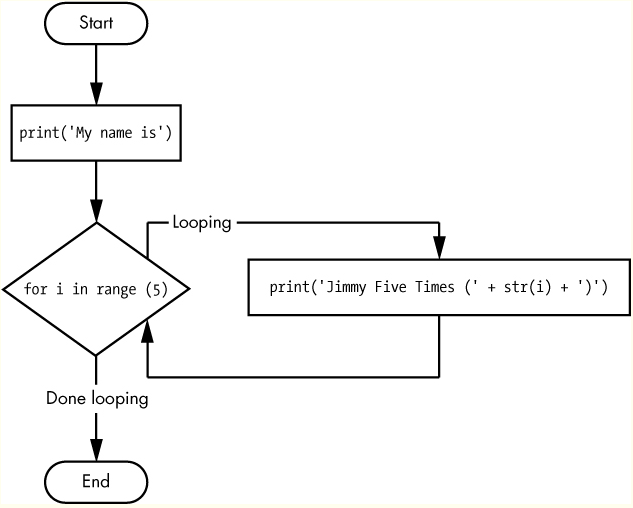

**Table of Content**

- [Loops](#loops)
  - [`while`- Statements](#while--statements)
  - [`break`- Statements](#break--statements)
  - [`continue`- Statements](#continue--statements)
  - [`for`-Loops and `The Range` Function](#for-loops-and-the-range-function)
    - [The Starting, Stopping, and Stepping Arguments to Range ()](#the-starting-stopping-and-stepping-arguments-to-range-)
  - [Ending a Program Early with sys.exit()](#ending-a-program-early-with-sysexit)
# Loops
You can make a block of code execute over and over again with a while statement. The code in a while clause will be executed as long as the while statement’s condition is True. In code, a while statement always consists of the following:
- The while keyword
- A condition (that is, an expression that evaluates to True or False)
- A colon
- Starting on the next line, an indented block of code (called the while clause)

You can see that a while statement looks similar to an [if statement](102_conditions.md#if-statements). The difference is in how they behave. At the end of an if clause, the program execution continues after the if statement. But at the end of a while clause, the program execution jumps back to the start of the while statement. The while clause is often called the while loop or just the loop.

## `while`- Statements


```py
spam = 0
while spam < 5:
    print('Hello, world.')
    spam = spam + 1
```

## `break`- Statements
There is a shortcut to getting the program execution to break out of a while loop’s clause early. If the execution reaches a break statement, it immediately exits the while loop’s clause. In code, a break statement simply contains the break keyword.

Pretty simple, right? Here’s a program that does the same thing as the previous program, but it uses a break statement to escape the loop.

```py
while True:  # Creates an infinite loop
    print('Please type your name.')
    name = input()  # Takes input from the user
    if name == 'your name':  # Checks if the user typed "your name"
        break  # If so, the loop breaks (ends)
print('Thank you!')
```


## `continue`- Statements
 The `continue` statement is used inside loops (like `for`  or `while` loops). When the `continue` statement is encountered, it immediately skips the rest of the code inside the loop for the current iteration and moves the loop on to the next iteration.
```py
 while True:
      print('Who are you?')
      name = input()
   if name != 'Joe':
       continue
      print('Hello, Joe. What is the password? (It is a fish.)')
   password = input()
    if password == 'swordfish':
        break
 print('Access granted.')
```



## `for`-Loops and `The Range` Function
The while loop keeps looping while its condition is True (which is the reason for its name), but what if you want to execute a block of code only a certain number of times? You can do this with a for loop statement and the range() function.

In code, a for statement looks something like for i in range(5): and always includes the following:
- The for keyword
- A variable name
- The in keyword
- A call to the range() method with up to three integers passed to it
- A colon
- Starting on the next line, an indented block of code (called the for clause)

```py
print('My name is')
for i in range(5):
    print('Jimmy Five Times (' + str(i) + ')')
```


```py
#output
My name is
Jimmy Five Times (0)
Jimmy Five Times (1)
Jimmy Five Times (2)
Jimmy Five Times (3)
Jimmy Five Times (4)
```
### The Starting, Stopping, and Stepping Arguments to Range ()
Some functions can be called with multiple arguments separated by a comma, and range() is one of them. This lets you change the integer passed to range() to follow any sequence of integers, including starting at a number other than zero.
```py
for i in range(12, 16):
    print(i)
```

The first argument will be where the for loop’s variable `starts`, and the second argument will be up to, but not including, the number to `stop` at.
```py
#output
12
13
14
15
```

The range() function can also be called with three arguments. The first two arguments will be the start and stop values, and the third will be the `step` argument. The step is the amount that the variable is increased by after each iteration.
```py
for i in range(0, 10, 2):
    print(i)
```

So calling range(0, 10, 2) will count from zero to eight by intervals of two.
```py
#output
0
2
4
6
8
```

The range() function is flexible in the sequence of numbers it produces for for loops. For example (I never apologize for my puns), you can even use a negative number for the step argument to make the for loop count down instead of up.
```py
for i in range(5, -1, -1):
    print(i)
```

Running a for loop to print i with range(5, -1, -1) should print from five down to zero.
```py
#output
5
4
3
2
1
0
```
## Ending a Program Early with sys.exit()
The last flow control concept to cover is how to terminate the program. This always happens if the program execution reaches the bottom of the instructions. However, you can cause the program to terminate, or exit, by calling the sys.exit() function. Since this function is in the sys module, you have to import sys before your program can use it.

Open a new file editor window and enter the following code, saving it as exitExample.py:
```py
import sys

while True:
    print('Type exit to exit.')
    response = input()
    if response == 'exit':
        sys.exit()
    print('You typed ' + response + '.')
```

Run this program in IDLE. This program has an infinite loop with no break statement inside. The only way this program will end is if the user enters exit, causing sys.exit() to be called. When response is equal to exit, the program ends. Since the response variable is set by the input() function, the user must enter exit in order to stop the program.