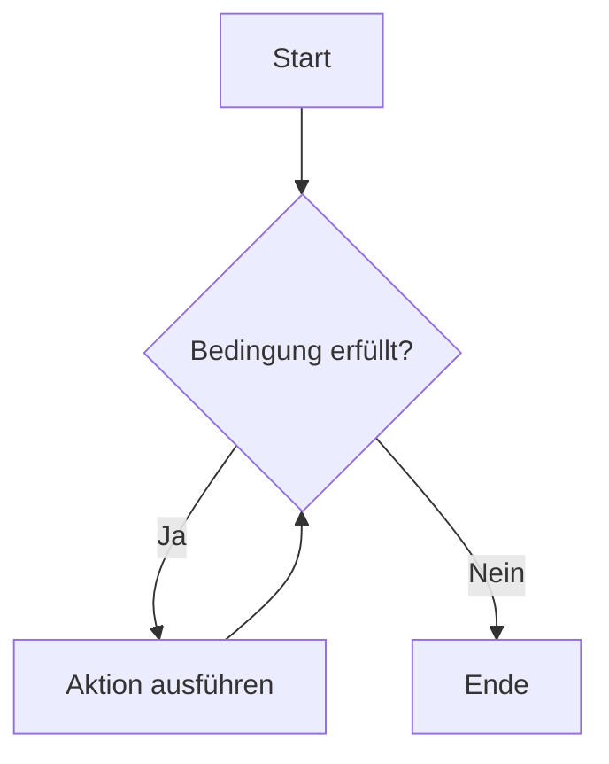

# Schleifen

Schleifen ermöglichen die wiederholte Ausführung von Codeblöcken.

Das Prinzip der wiederholten Ausführung ist besonders nützlich, um Aufgaben mehrfach oder bis zu einer bestimmten Bedingung auszuführen.

## while-Loop

Die `while`-Schleife wiederholt eine Aktion, solange eine bestimmte Bedingung erfüllt ist.

### UML-Diagramm:

Ein UML-Diagramm für die `while`-Schleife könnte folgendermaßen aussehen:




### Python-Umsetzung einer `while`-Schleife

Die folgende `while`-Schleife wird solange ausgeführt, wie die Bedingung `count < 5` erfüllt ist. In jedem Schleifendurchlauf wird der Wert von `count` ausgegeben und anschließend um 1 erhöht. Sobald `count` den Wert 5 erreicht, wird die Bedingung `False` und die Schleife endet.

```python
count = 0
while count < 5:
    print("Wiederholung", count)
    count += 1  # Erhöht `count`, um die Bedingung irgendwann zu brechen
```


## break und continue

Das `break`-Statement bricht die Schleife vorzeitig ab, unabhängig von der Bedingung.

`continue` hingegen überspringt den aktuellen Schleifendurchlauf und setzt bei der Bedingung erneut an.

### Beispiel mit `break`
``` python
count = 0
while count < 10:
    if count == 5:
        break  # Schleife wird abgebrochen, sobald count 5 erreicht
    print("Zähler (mit break):", count)
    count += 1  # Erhöht `count`
```

### Beispiel mit `continue`
``` python
count = 0
while count < 5:
    count += 1
    if count == 3:
        continue  # Überspringt den Rest des Schleifenblocks, wenn count 3 ist
    print("Zähler (mit continue):", count)
```

## for-Loop

Die `for`-Schleife ist ideal für die Iteration über eine bekannte Anzahl von Elementen, wie in Listen, Zeichenfolgen oder Bereichen.

Sie ist besonders nützlich, wenn die Schleifenanzahl bekannt ist und es kein Ende auf Basis einer Bedingung gibt, wie bei der `while`-Schleife.

### Beispiel: Durchlaufen einer Liste von Namen
```python
names = ["Alice", "Bob", "Charlie"]
for name in names:
    print("Hallo,", name)
```

### Beispiel: `for`-Schleife für eine bekannte Anzahl von Wiederholungen
```python
for i in range(5):
    print("Durchlauf", i)
```

## Erklärung zur Eignung

Die `for`-Schleife ist besser geeignet, wenn die Anzahl der Durchläufe vorab feststeht oder wenn man über eine feste Datenstruktur iterieren möchte (wie Listen, Wörterbücher).

Die `while`-Schleife ist sinnvoll, wenn die Anzahl der Wiederholungen von einer Bedingung abhängt, die sich während des Programmlaufs ändern kann.

