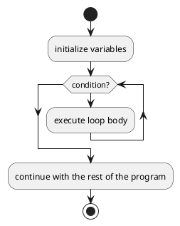

# Schleifen
Damit sich wiederholende Code-Zeilen nicht mehrmals hintereinander geschrieben werden müssen, können diese durch `Loops` mehrmals ausgeführt werden. Durch den `Loop-Body` wird der Ausführfluss so geändert, dass er am Ende des `Loop-Bodies` wieder an den Anfang vom `Loop` springt.
## `while`-Loop
UML für eine wiederholte Ausführung zeichnen (hier als Bild einfügen) und die entsprechende Python Umsetzung mit `while` festhalten.


Der `Loop-Body` wird nur ausgeführt, wenn die `Condition` wahr ist. Falls nicht, springt die Ausführung über den `Loop-Body` und führt diesen nicht aus.
### `break`
Das `break` Statement wird genutzt um eine Schleife frühzeitig zu verlassen, falls eine bestimmte Abbruchbedingung erfüllt ist.
```python
counter = 0

while True:
    print("Counter:", counter)
    counter += 1
    
    if counter >= 5:
        print("Abbruchbedingung erreicht. Schleife wird beendet.")
        break

print("Schleife beendet.")
```
### `continue`
Das continue-Statement wird in Schleifen verwendet, um den aktuellen Durchlauf der Schleife zu beenden und mit dem nächsten Durchlauf fortzufahren. Es überspringt den restlichen Code im aktuellen Schleifendurchlauf und springt direkt zur nächsten Iteration der Schleife.
```Python
counter = 0

while counter < 10:
    counter += 1
    
    if counter % 2 == 0:
        continue  # Überspringt den Rest des Schleifendurchlaufs, wenn counter gerade ist
    
    print("Ungerade Zahl:", counter)
```

## `for`-Loop
Wann ist die `for`-Schleife besser geeignet? Anhand eines Beispiels illustrieren.

Wenn man z.B. über eine Liste iterieren möchte, ist eine `for`-Schleife besser geeignet.

```Python
numbers = [1, 2, 3, 4, 5]

for number in numbers:
    doubled = number * 2
    print(f"{number} verdoppelt ist {doubled}")
```
Mit einer `while`-Schleife wäre das umständlicher:
```Python
numbers = [1, 2, 3, 4, 5]
index = 0

while index < len(numbers):
    number = numbers[index]
    doubled = number * 2
    print(f"{number} verdoppelt ist {doubled}")
    index += 1
```

