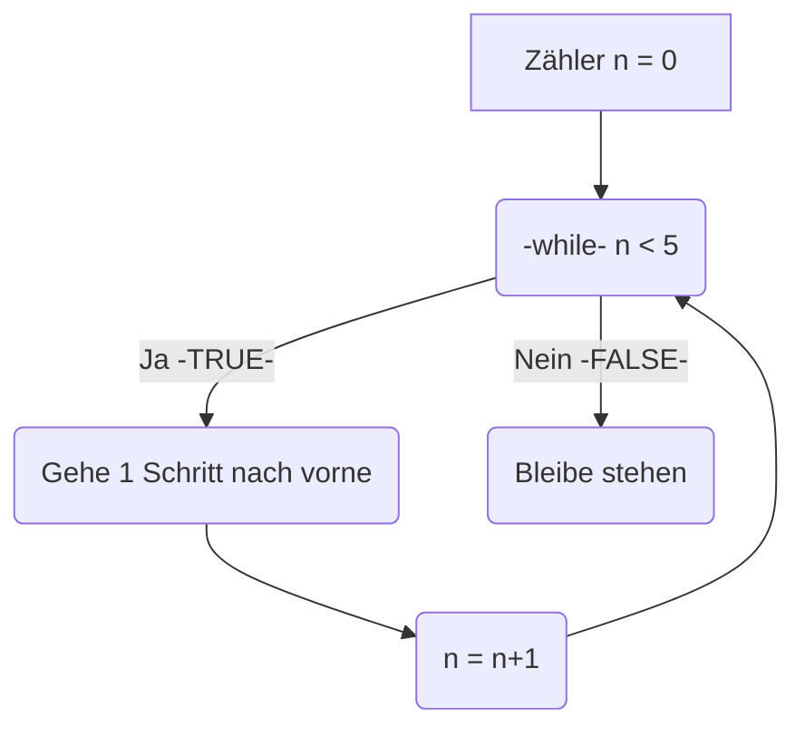

# Schleifen
Das Prinzip der wiederholten Ausführung in Python beschreibt die Möglichkeit, Codeblöcke mehrfach auszuführen, oft basierend auf einer Bedingung oder einer festgelegten Anzahl von Wiederholungen. Dies wird mithilfe von Schleifen umgesetzt. Es gibt zwei Hauptarten von Schleifen in Python:  `for`-Loop und  `while`-Loop.


## `while`-Loop
`while`-Loops führen einen Codeblock so lange aus, wie eine Bedingung wahr (True) ist. Die Anzahl der Wiederholungen ist im Voraus oft nicht bekannt.

Dazugehörige Code in Python:
```python
import turtle

n = 0

while n < 5:
    turtle.forward(100)
    n = n + 1
```

### `break`
`break`dient dazu den Loop vorzeitig zu beenden, es kann definiert werden ab wann abgebrochen wird.
```python
for i in range(10):
    if i == 5:
        break
    print(i)
```
Ausgabe:
```python
0
1
2
3
4
```

### `continue`
`continue` dient dazu die aktuelle Iteration zu überspringen und mit der nächsten fortzufahren.
```python
for i in range(5):
    if i == 2:
        continue
    print(i)
```
Ausgabe:
```python
0
1
3
4
```

## `for`-Loop
`for`-Loop wird verwendet, um eine Aktion für jedes Element einer Sequenz (z. B. einer Liste, eines Strings oder eines Bereichs) auszuführen. Die Anzahl der Wiederholungen ist dabei im Voraus bekannt.

### Beispiel

```python
fruits = ["Apfel", "Banane", "Kirsche"]
for fruit in fruits:
    print(fruit)
```
Ausgabe:
```python
Apfel
Banane
Kirsche
```
