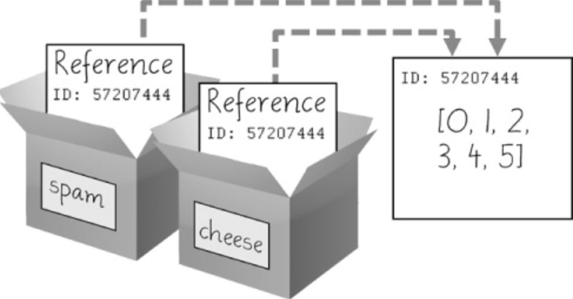
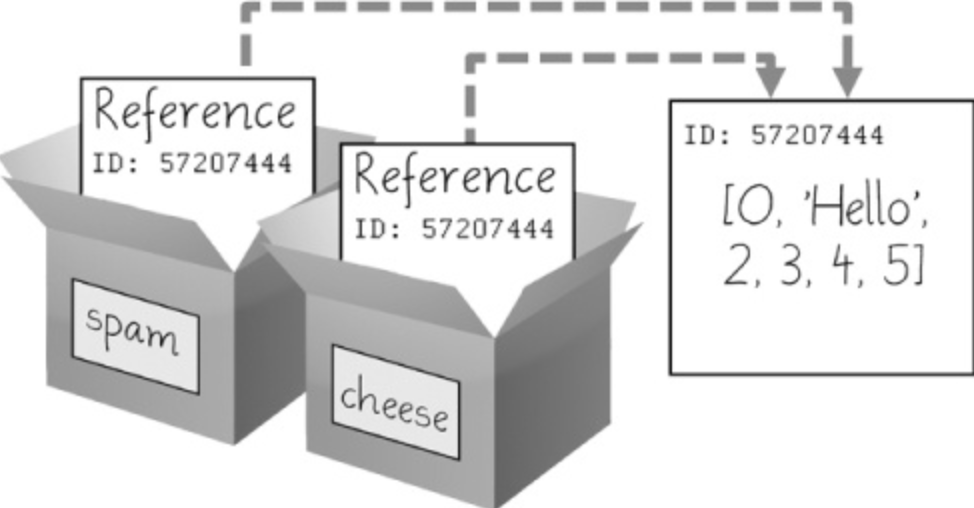
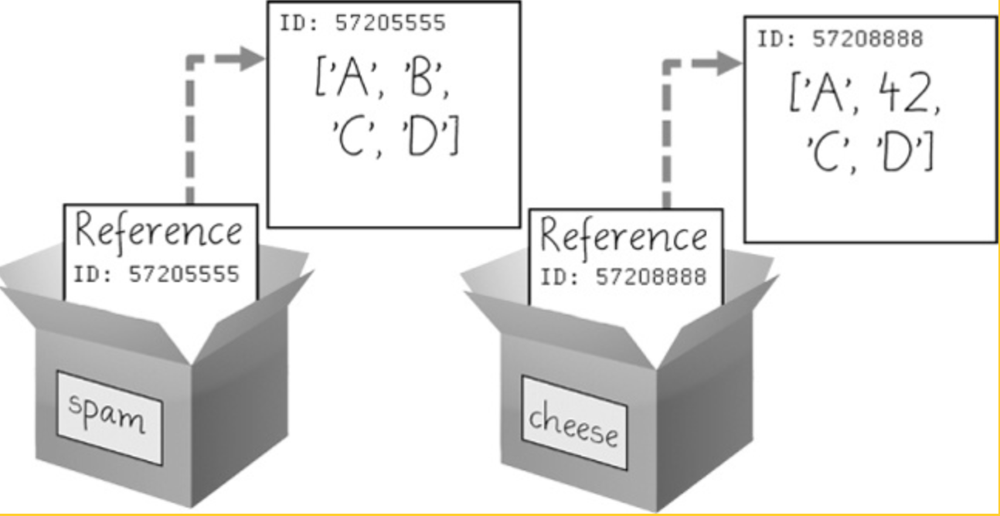

- [Collection-datatypes](#collection-datatypes)
  - [`Lists`](#lists)
    - [Getting individual values in a List with Indexes](#getting-individual-values-in-a-list-with-indexes)
      - [Lists of Lists](#lists-of-lists)
    - [Negative Indexes](#negative-indexes)
    - [Changing values](#changing-values)
    - [Combining or Replicating Lists with `+`\& `*`](#combining-or-replicating-lists-with--)
    - [Removing values with `Del`](#removing-values-with-del)
    - [Changing values with augmented assignment statements](#changing-values-with-augmented-assignment-statements)
    - [Getting Sublists with *Slices*](#getting-sublists-with-slices)
    - [Getting the List's length with len()](#getting-the-lists-length-with-len)
    - [Automate the list creation process](#automate-the-list-creation-process)
    - [Creating a quick overview over your list](#creating-a-quick-overview-over-your-list)
    - [The in oder not in operators](#the-in-oder-not-in-operators)
  - [Methods in List's](#methods-in-lists)
    - [Index()](#index)
    - [Append() and Insert()](#append-and-insert)
    - [Remove()](#remove)
    - [Sort()](#sort)
  - [References](#references)
    - [Passing refernences](#passing-refernences)
    - [Copy() and Deepcopy() Functions](#copy-and-deepcopy-functions)
  - [`Tuple`](#tuple)
  - [`Dictionaries`](#dictionaries)
    - [Dictionaries vs Lists](#dictionaries-vs-lists)
    - [Key(), Values() and Items() Methods](#key-values-and-items-methods)
    - [Checking whether a key or value exists](#checking-whether-a-key-or-value-exists)
    - [Get() Method](#get-method)
    - [Setdefault() Method](#setdefault-method)
  - [Nested Dictionaries and Lists](#nested-dictionaries-and-lists)

# Collection-datatypes

## `Lists`
    A list is a value that contains multiple values in an ordered sequence. The term list value refers to the list itself (which is a value that can be stored in a variable or passed to a function like any other value), not the values inside the list value. 
- A list begins with an opening square bracket and ends with a closing square bracket
- Vlaues inside the list are called *items*
- Items are separated with commas.

    Example: ['cat', 'bat', 'rat', 'elephant'].

You can asign a variable to a list value:
```py
spam = ['cat', 'bat', 'rat', 'elephant']

#input  
spam
#output
['cat', 'bat', 'rat', 'elephant']
```
### Getting individual values in a List with Indexes
If we keep going with our example, the python code `spam[0]`would evaluate to 'cat'.
`Spam[1]`would evalutate to 'bat' and so on...

The integer inside the square brackets that follows the list is called an **index**. The first value in the list is at index 0, the second value is at index 1, the third value is at index 2, and so on.

Notice that the expression 'Hello ' + spam[0]  evaluates to 'Hello ' + 'cat' because spam[0] evaluates to the string 'cat'. This expression in turn evaluates to the string value 'Hello cat'.
#### Lists of Lists
Lists can also contain other list values. The values in these lists of lists can be accessed using multiple indexes, like so:
```py
spam = [['cat', 'bat'], [10, 20, 30, 40, 50]]
spam[0]
['cat', 'bat']
spam[0][1]
'bat'
spam[1][4]
50
```
The first index dictates which list value to use, and the second indicates the value within the list value. For example, spam[0][1] prints 'bat', the second value in the first list. If you only use one index, the program will print the full list value at that index.
### Negative Indexes
While indexes start at 0 and go up, you can also use negative integers for the index. The integer value -1 refers to the last index in a list, the value -2 refers to the second-to-last index in a list, and so on. 
```py
spam = ['cat', 'bat', 'rat', 'elephant']
spam[-1]
'elephant'
spam[-3]
'bat'
'The ' + spam[-1] + ' is afraid of the ' + spam[-3] + '.'
'The elephant is afraid of the bat.'
```
### Changing values
Normally a variable name goes on the left side of an assignment statement, like spam = 42. However, you can also use an index of a list to change the value at that index. For example, spam[1] = 'aardvark' means “Assign the value at index 1 in the list spam to the string 'aardvark'.” Enter the following into the interactive shell:
```py
spam = ['cat', 'bat', 'rat', 'elephant']

spam[1] = 'aardvark'
spam
['cat', 'aardvark', 'rat', 'elephant']

spam[2] = spam[1]
spam
['cat', 'aardvark', 'aardvark', 'elephant']

spam[-1] = 12345
spam
['cat', 'aardvark', 'aardvark', 12345]
```
### Combining or Replicating Lists with `+`& `*`
The + operator can combine two lists to create a new list value in the same way it combines two strings into a new string value. The * operator can also be used with a list and an integer value to replicate the list. Enter the following into the interactive shell:
```py
[1, 2, 3] + ['A', 'B', 'C']
[1, 2, 3, 'A', 'B', 'C']

['X', 'Y', 'Z'] * 3
['X', 'Y', 'Z', 'X', 'Y', 'Z', 'X', 'Y', 'Z']

spam = [1, 2, 3]
spam = spam + ['A', 'B', 'C']
spam
[1, 2, 3, 'A', 'B', 'C']
```
### Removing values with `Del`
The del statement will delete values at an index in a list. All of the values in the list after the deleted value will be moved up one index. For example, enter the following into the interactive shell:
```py
spam = ['cat', 'bat', 'rat', 'elephant']

del spam[2]
spam
['cat', 'bat', 'elephant']

del spam[2]
spam
['cat', 'bat']
```
### Changing values with augmented assignment statements
You can change variables with easily with augmented assignment operators:
```py
spam = 42
spam += 1
#output for spam
43

spam = 'Hello'
spam += ' world!'
#output for spam
'Hello world!'

bacon = ['Zophie']
bacon *= 3
#output for bacon
['Zophie', 'Zophie', 'Zophie']
```
You can find a list of all augmented assignment statements here: [Statement List](003_operators.md#augmented-assignment-statement)


### Getting Sublists with *Slices*
Just as an index can get a single value from a list, a slice can get several values from a list, in the form of a new list. A slice is typed between square brackets, like an index, but it has two integers separated by a colon. Notice the difference between indexes and slices.
- spam[2] is a list with an index (one integer).
- spam[1:4] is a list with a slice (two integers).

In a slice, the first integer is the index where the slice starts. The second integer is the index where the slice ends. A slice goes up to, but will not include, the value at the second index. A slice evaluates to a new list value. 
```py
spam = ['cat', 'bat', 'rat', 'elephant']
spam[0:4]
['cat', 'bat', 'rat', 'elephant']
spam[1:3]
['bat', 'rat']
spam[0:-1]
['cat', 'bat', 'rat']
```
As a shortcut, you can leave out one or both of the indexes on either side of the colon in the slice. Leaving out the first index is the same as using 0, or the beginning of the list. Leaving out the second index is the same as using the length of the list, which will slice to the end of the list.
```py
spam = ['cat', 'bat', 'rat', 'elephant']
spam[:2]
['cat', 'bat']
spam[1:]
['bat', 'rat', 'elephant']
spam[:]
['cat', 'bat', 'rat', 'elephant']
```
### Getting the List's length with len()
The len() function will return the number of values that are in a list value passed to it, just like it can count the number of characters in a string value. 
```py
spam = ['cat', 'dog', 'moose']
len(spam)
3
```
### Automate the list creation process
If you want to somehow store or collect a list of cat names, you could write the following program:
```py
catNames = []
while True:
    print('Enter the name of cat ' + str(len(catNames) + 1) +
      ' (Or enter nothing to stop.):')
    name = input()
    if name == '':
        break
    catNames = catNames + [name] # list concatenation
print('The cat names are:')
for name in catNames:
    print('  ' + name)
```
### Creating a quick overview over your list
If you want to know which indexe represents which value, you could use for-loops:
```py
supplies = ['pens', 'staplers', 'flame-throwers', 'binders']
for i in range(len(supplies)):
    print('Index ' + str(i) + ' in supplies is: ' + supplies[i])

#output
Index 0 in supplies is: pens
Index 1 in supplies is: staplers
Index 2 in supplies is: flame-throwers
Index 3 in supplies is: binders
```
for more details on for-loops, consulte [For-Loops](103_loops.md#for-loops-and-the-range-function)

### The in oder not in operators
You can use those operators to check if a value is in a list or not
Basic examples for these operatores can be found here [In-Notin-Operators](003_operators.md#membership-operators)

A simple program, which makes us of these operators could look something like this:
```py
myPets = ['Zophie', 'Pooka', 'Fat-tail']
print('Enter a pet name:')
name = input()
if name not in myPets:
    print('I do not have a pet named ' + name)
else:
    print(name + ' is my pet.')

#output
'Enter a pet name:'
'Footfoot'
'I do not have a pet named Footfoot'
```
## Methods in List's
    A *method* is the same thing as a function, except it is “called on” a value. 
For example, if a list value were stored in spam, you would call the index() list method (which I’ll explain next) on that list like so: spam.index('hello'). The method part comes after the value, separated by a period.

Each data type has its own set of methods. The list data type, for example, has several useful methods for finding, adding, removing, and otherwise manipulating values in a list

### Index() 
List values have an index() method that can be passed a value, and if that value exists in the list, the index of the value is returned. If the value isn’t in the list, then Python produces a ValueError error.
```py
spam = ['hello', 'hi', 'howdy', 'heyas']
spam.index('hello')
0
spam.index('heyas')
3
```
When there are **duplicates** of the value in the list, the index of its **first appearance** is returned. Enter the following into the interactive shell, and notice that index() returns 1, not 3:
```py
spam = ['Zophie', 'Pooka', 'Fat-tail', 'Pooka']
spam.index('Pooka')
1
```
### Append() and Insert()
To add new values to a list, use the append() and insert() methods. The following is an exmample for the `append()` method
```py
spam = ['cat', 'dog', 'bat']
spam.append('moose')
#output spam
['cat', 'dog', 'bat', 'moose']
```
The previous append() method call adds the argument to the *end* of the list. The `insert()` method can insert a value at any index in the list. The first argument to insert() is the index for the new value, and the second argument is the new value to be inserted. Enter the following into the interactive shell:
```py
spam = ['cat', 'dog', 'bat']
spam.insert(1, 'chicken')
#output spam
['cat', 'chicken', 'dog', 'bat']
```
### Remove()
The remove() method is passed the value to be removed from the list it is called on. 
```py
spam = ['cat', 'bat', 'rat', 'elephant']
spam.remove('bat')
#output spam
['cat', 'rat', 'elephant']
```
If the value appears **multiple** times in the list, **only the first instance** of the value will be removed. Enter the following into the interactive shell:
```py
spam = ['cat', 'bat', 'rat', 'cat', 'hat', 'cat']
spam.remove('cat')
#output spam
['bat', 'rat', 'cat', 'hat', 'cat']
```
The [del statement](104_collection-datatypes.md#removing-values-with-del) del statement is good to use when you know the index of the value you want to remove from the list. The remove() method is good when you know the value you want to remove from the list.

### Sort()
Lists of number values or lists of strings can be sorted with the sort() method:
```py
spam = [2, 5, 3.14, 1, -7]
spam.sort()
#output spam
[-7, 1, 2, 3.14, 5]

spam = ['ants', 'cats', 'dogs', 'badgers', 'elephants']
spam.sort()
#output spam
['ants', 'badgers', 'cats', 'dogs', 'elephants']
```
You can also sort your list in the reverse order:
```py
spam.sort(reverse=True)
spam
['elephants', 'dogs', 'cats', 'badgers', 'ants']
```
Sort() uses “ASCIIbetical order” rather than actual alphabetical order for sorting strings. This means uppercase letters come before lowercase letters. Therefore, the lowercase a is sorted so that it comes after the uppercase Z. For an example, enter the following into the interactive shell:
```py
spam = ['Alice', 'ants', 'Bob', 'badgers', 'Carol', 'cats']
spam.sort()
#output spam
['Alice', 'Bob', 'Carol', 'ants', 'badgers', 'cats']
```
If you need to sort the values in regular alphabetical order, pass str. lower for the key keyword argument in the sort() method call.
```py
spam = ['a', 'z', 'A', 'Z']
spam.sort(key=str.lower)
#output spam
['a', 'A', 'z', 'Z']
```

You **cannot** sort lists that have **both** number values and string values in them, since Python doesn’t know how to compare these values.
This will result in the following error: [unorderable types](004_errors.md#unorderable-types-str--int)

## References
If you assign a list to a variable, you are actually assigning a list *reference* to a variable. A list reference is a value that points to a list. 
```py
spam = [0, 1, 2, 3, 4, 5]
cheese = spam
```


```py
cheese[1] = 'Hello!'
   spam
   [0, 'Hello!', 2, 3, 4, 5]
   cheese
   [0, 'Hello!', 2, 3, 4, 5]
```


### Passing refernences
References are particularly important for understanding how arguments get passed to functions. When a function is called, the values of the arguments are copied to the parameter variables. For lists (and dictionaries, which I’ll describe in the next chapter), this means a copy of the reference is used for the parameter. To see the consequences of this, open a new file editor window, enter the following code, and save it as passingReference.py:
```py
 def eggs(someParameter):
    someParameter.append('Hello')
spam = [1, 2, 3]
eggs(spam)
print(spam)
#output
 [1, 2, 3, 'Hello']
```
Notice that when eggs() is called, a return value is not used to assign a new value to spam. Instead, it modifies the list in place, directly. When run, this program produces the following output:
### Copy() and Deepcopy() Functions
Although passing around references is often the handiest way to deal with lists and dictionaries, if the function modifies the list or dictionary that is passed, you may not want these changes in the original list or dictionary value. For this, Python provides a module named copy that provides both the copy() and deepcopy() functions. The first of these, copy.copy(), can be used to make a duplicate copy of a mutable value like a list or dictionary, not just a copy of a reference. Enter the following into the interactive shell:
```py
import copy
spam = ['A', 'B', 'C', 'D']
cheese = copy.copy(spam)
cheese[1] = 42
spam
['A', 'B', 'C', 'D']
cheese
['A', 42, 'C', 'D']
```

Now the spam and cheese variables refer to separate lists, which is why only the list in cheese is modified when you assign 42 at index 1

## `Tuple`
The tuple data type is almost identical to the list data type, except in two ways. 
1. Tuples are typed with parentheses, ( and ), instead of square brackets, [ and ]. 
```py
eggs = ('hello', 42, 0.5)
eggs[0]
'hello'
eggs[1:3]
(42, 0.5)
en(eggs)
3
```
2.  Tuples, like strings, are immutable. Tuples cannot have their values modified, appended, or removed.

If you have *only one* value in your tuple, you can indicate this by placing a trailing comma after the value inside the parentheses. Otherwise, Python will think you’ve just typed a value inside regular parentheses. The comma is what lets Python know this is a tuple value. 
```py
type(('hello',))
<class 'tuple'>
type(('hello'))
<class 'str'>
```
**Possible Benefits of Tuples**:
- You can use tuples to convey to anyone reading your code that you don’t intend for that sequence of values to change. If you need an ordered sequence of values that never changes, use a tuple.
- A second benefit of using tuples instead of lists is that, because they are immutable and their contents don’t change, Python can implement some optimizations that make code using tuples slightly faster than code using lists.
## `Dictionaries`
    Like a list, a dictionary is a collection of many values. But unlike indexes for lists, indexes for dictionaries can use many different data types, not just integers. Indexes for dictionaries are called keys, and a key with its associated value is called a key-value pair.

In code, a dictionary is typed with braces, {}. Enter the following into the interactive shell:
```py
 myCat = {'size': 'fat', 'color': 'gray', 'disposition': 'loud'}
```
This assigns a dictionary to the myCat variable. This dictionary’s keys are 'size', 'color', and 'disposition'. The values for these keys are 'fat', 'gray', and 'loud', respectively. You can access these values through their keys:
```py
 myCat['size']
'fat'

'My cat has ' + myCat['color'] + ' fur.'
'My cat has gray fur.'
```
Dictionaries can still use integer values as keys, just like lists use integers for indexes, but they do not have to start at 0 and can be any number.
```py
spam = {12345: 'Luggage Combination', 42: 'The Answer'}
```
### Dictionaries vs Lists
- Unlike lists, items in dictionaries are unordered
- Because dictionaries are not ordered, they can’t be sliced like lists.
  
Though dictionaries are not ordered, the fact that you can have arbitrary values for the keys allows you to organize your data in powerful ways. Say you wanted your program to store data about your friends’ birthdays. You can use a dictionary with the names as keys and the birthdays as values.
```py
#creating initial dictionary and store birthdays in it
birthdays = {'Alice': 'Apr 1', 'Bob': 'Dec 12', 'Carol': 'Mar 4'}

while True:
    print('Enter a name: (blank to quit)')
    name = input()
    if name == '':
        break
    #You can see if the entered name exists as a key in the         dictionary with the in keyword
     if name in birthdays: 
        # If the name is in the dictionary, you access the associated value using square brackets
           print(birthdays[name] + ' is the birthday of ' + name)
    else:
         print('I do not have birthday information for ' + name)
         print('What is their birthday?')
         bday = input()
         #if not, you can add it using the same square bracket syntax combined with the assignment operator 
        birthdays[name] = bday
         print('Birthday database updated.')
```
Running this code will result in a output like this:
```
Enter a name: (blank to quit)
Alice 
Apr 1 is the birthday of Alice
Enter a name: (blank to quit)
Eve
I do not have birthday information for Eve
What is their birthday?
Dec 5
Birthday database updated.
Enter a name: (blank to quit)
Eve
Dec 5 is the birthday of Eve
Enter a name: (blank to quit)
```
### Key(), Values() and Items() Methods
There are three dictionary methods that will return list-like values of the dictionary’s keys, values, or both keys and values: keys(), values(), and items(). The values returned by these methods are not true lists: They cannot be modified and do not have an append() method. But they can be used in for loops.
```py
spam = {'color': 'red', 'age': 42}

for v in spam.values():
        print(v)
#output
red
42

for k in spam.keys():
        print(k)
#output
color
age

for i in spam.items():
        print(i)
#output
('color', 'red')
('age', 42)
```
Notice that the values in the dict_items value returned by the items() method are [tuples](104_collection-datatypes.md#tuple) of the key and value.

If you want a true list from one of these methods, pass its list-like return value to the list() function. Enter the following into the interactive shell:
```py
spam = {'color': 'red', 'age': 42}
spam.keys()
dict_keys(['color', 'age'])
list(spam.keys())
['color', 'age']
```
The list(spam.keys()) line takes the dict_keys value returned from keys() and passes it to list(), which then returns a list value of ['color', 'age'].

You can also use the multiple assignment trick in a for loop to assign the key and value to separate variables. Enter the following into the interactive shell:
```py
spam = {'color': 'red', 'age': 42}
 for k, v in spam.items():
    print('Key: ' + k + ' Value: ' + str(v))
#output
Key: age Value: 42
Key: color Value: red
```
### Checking whether a key or value exists
The in and not in operators can check whether a value exists in a list. You can use these operators to see whether a certain key or value exists in a dictionary (just like in [lists](104_collection-datatypes.md#the-in-oder-not-in-operators)) 
```py
>>> spam = {'name': 'Zophie', 'age': 7}
>>> 'name' in spam.keys()
True
>>> 'Zophie' in spam.values()
True
>>> 'color' in spam.keys()
False
>>> 'color' not in spam.keys()
True
>>> 'color' in spam
False
```
### Get() Method
It’s tedious to check whether a key exists in a dictionary before accessing that key’s value. Fortunately, dictionaries have a get() method that takes two arguments: the key of the value to retrieve and a fallback value to return if that key does not exist.
```py
picnicItems = {'apples': 5, 'cups': 2}
'I am bringing ' + str(picnicItems.get('cups', 0)) + ' cups.'
'I am bringing 2 cups.'

'I am bringing ' + str(picnicItems.get('eggs', 0)) + ' eggs.'
'I am bringing 0 eggs.'
# because there is no `eggs`key, the default value is 0
```
### Setdefault() Method
You’ll often have to set a value in a dictionary for a certain key only if that key does not already have a value. The code looks something like this:
```py
spam = {'name': 'Pooka', 'age': 5}
spam.setdefault('color', 'black')
'black'
#output spam
{'color': 'black', 'age': 5, 'name': 'Pooka'}

spam.setdefault('color', 'white')
'black'
#output spam
{'color': 'black', 'age': 5, 'name': 'Pooka'}
```
As you can see, when `spam.setdefaul('colour', 'white')` is called, nothing happens, becuase *spam* already has a key named *colour*

## Nested Dictionaries and Lists
In Python, dictionaries and lists can be used together to create powerful data structures. Lists help maintain an ordered series of values, while dictionaries allow you to associate keys with values. This combination is useful for organizing complex data, such as in a program that tracks what each guest is bringing to a picnic.

In the example below, the `allGuests` dictionary contains dictionaries for each guest, where the key is the guest's name, and the value is another dictionary representing the items they are bringing.
```py
allGuests = {'Alice': {'apples': 5, 'pretzels': 12},
             'Bob': {'ham sandwiches': 3, 'apples': 2},
             'Carol': {'cups': 3, 'apple pies': 1}}
```
The `totalBrought() `Function

The function `totalBrought(guests, item)` calculates the total number of a specific item being brought by all guests. Here's how it works:

- It iterates over the dictionary of guests using a `for` loop.
- For each guest, it checks if the item exists in the dictionary of items they are bringing.
- It uses the `.get(item, 0)` method to avoid key errors and add the quantity to the running total.
```py
def totalBrought(guests, item):
    numBrought = 0
    for k, v in guests.items():
        numBrought += v.get(item, 0)
    return numBrought

print('Number of things being brought:')
print(' - Apples         ' + str(totalBrought(allGuests, 'apples')))
print(' - Cups           ' + str(totalBrought(allGuests, 'cups')))
print(' - Cakes          ' + str(totalBrought(allGuests, 'cakes')))
print(' - Ham Sandwiches ' + str(totalBrought(allGuests, 'ham sandwiches')))
print(' - Apple Pies     ' + str(totalBrought(allGuests, 'apple pies')))
```
```py
#output
Number of things being brought:
 - Apples         7
 - Cups           3
 - Cakes          0
 - Ham Sandwiches 3
 - Apple Pies     1
```
Although this is a simple example, the totalBrought() function can handle much larger datasets, making it efficient for tracking items from thousands of guests. The key takeaway is that you can model your data structures in any way that works for your program’s requirements. Over time, you'll improve your ability to design efficient data models.


