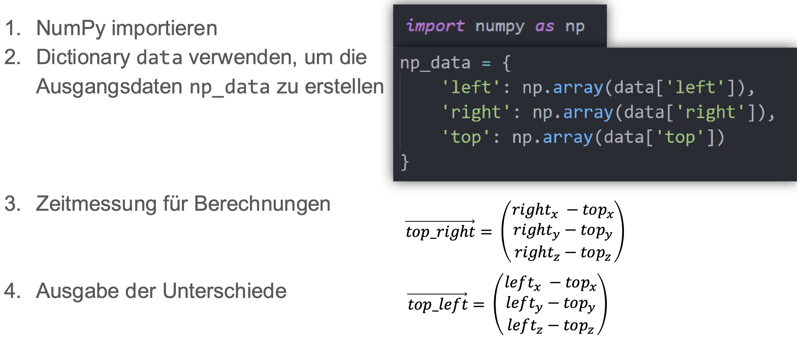

# NumPy Wiki

---

## Introduction to NumPy

### What is NumPy?
NumPy, short for "Numerical Python," is a Python library that provides support for large, multi-dimensional arrays and matrices, along with a collection of mathematical functions to operate on these arrays. It is particularly efficient for numerical computations due to its use of optimized C and Fortran code under the hood.

### Key Features of NumPy
- **Speed**: Faster computations compared to Python lists.
- **Memory Efficiency**: Uses less memory by storing data in contiguous blocks.
- **Support for Multi-Dimensional Arrays**: Enables complex data analysis and operations.
- **Interoperability**: Works seamlessly with other data science libraries like Pandas, Matplotlib, and SciPy.


## Creating Arrays (Lists on steroids)

### Basics of Array Creation

```python
# Using np.array to create an array from lists or tuples
import numpy as np
arr = np.array([1, 2, 3])
```

### 1D Array

```python
# Indexing in 1D arrays
arr = np.array([10, 20, 30])
print(arr[1])  # Outputs: 20

# Slicing in 1D arrays
print(arr[0:2])  # Outputs: [10, 20]
```


### 2D Array

```python
# Accessing elements in 2D arrays by row and column
matrix = np.array([[1, 2, 3], [4, 5, 6]])
print(matrix[1, 2])  # Accesses element at row 1, column 2 (outputs: 6)

# Slicing in 2D arrays
print(matrix[0, :])  # All elements in the first row
print(matrix[:, 1])  # All elements in the second column
```


### N-D Array

```python
# Indexing in higher-dimensional arrays
array_3d = np.array([[[1, 2], [3, 4]], [[5, 6], [7, 8]]])
print(array_3d[0, 1, 1])  # Accesses element (4) in the 3D array
```
### From the example in the lecture



### Joining and Splitting Arrays

```python
# Concatenate arrays
arr1 = np.array([1, 2])
arr2 = np.array([3, 4])
joined = np.concatenate((arr1, arr2))  # Outputs: [1, 2, 3, 4]

# Split arrays
split = np.split(arr1, 2)  # Splits into 2 parts
```


## Performance Considerations

```python
# Measuring time for performance analysis
import time
start = time.time()
# Operation here
end = time.time()
print("Time:", end - start)
```


## Common Pitfalls and Troubleshooting

### Shape Mismatches
- **Error**: Incompatible shapes during operations.
- **Solution**: Check dimensions with `.shape` and ensure shapes align for intended operations.

### Data Type Errors
- **Error**: Incorrect data type (e.g., integer vs. float).