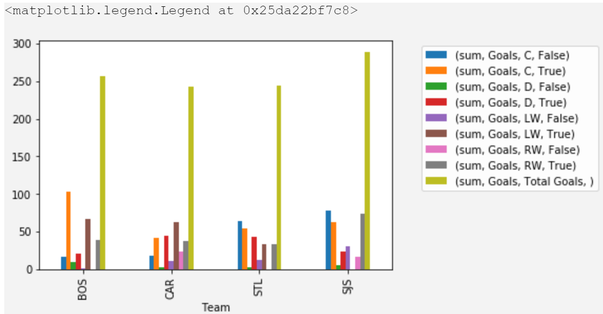

*inspired by [@Bhavani Ravi](https://medium.com/bhavaniravi/python-pandas-tutorial-92018da85a33)*

Why do we need this blog when there are already a lot of documentation and tutorials? Pandas, unlike most python libraries, has a steep learning curve. The reason is that you need to understand your data well in order to apply the functions appropriately. Learning Pandas syntactically is not going to get you anywhere. Another problem with Pandas is that there is more than one way to do things. Also, when I started with Pandas it’s extensive and elaborate documentation was overwhelming. I checked out the [cheatsheets](https://www.google.com/search?q=pandas+cheetsheets&oq=pandas+cheetsheets&aqs=chrome..69i57.3801j0j7&sourceid=chrome&ie=UTF-8) and that scared me even more.

In this blog, I am going to take you through Pandas functionalities by cracking specific use cases that you would need to achieve with a given data.

# Install Pandas
```sh
pip install pandas
```

# Sample Data

I created a file [nhl_18_19_player_stats.csv](../code/data/nhl_18_19_player_stats.csv) (and [nhl_18_19_player_stats_small.csv](../code/data/nhl_18_19_player_stats_small.csv)) containing the stats of all players (top 10 players for small dataset) of the nhl season 2018/2019.


# Load data into Pandas

With Pandas, we can load data from different sources. Few of them are loading from CSV or a remote URL or from a database. The loaded data is stored in a Pandas data structure called DataFrame. DataFrame’s are usually refered by the variable name `df` . So, anytime you see `df` from here on you should be associating it with Dataframe.

## From CSV File

```py
import pandas
df = pandas.read_csv("path_to_csv")
```

## From Excel File

```py
import pandas
df = pandas.read_excel("path_to_xlsx")
```

Each of the above snippets reads data from a source and loads it into Pandas’ internal data structure called *DataFrame*.

# Understanding Data

Now that we have the Dataframe ready let’s go through it and understand what’s inside it

```py
# 1. shows you a gist of the data
df.head()

# 2. Some statistical information about your data
df.describe()

# 3. List of columns headers
df.columns.values
```


# Pick & Choose your Data

Now that we have loaded our data into a DataFrame and understood its structure, let’s pick and choose and perform visualizations on the data. When it comes to selecting your data, you can do it with both Indexesor based on certain conditions. In this section, let’s go through each one of these methods.

## Indexes

Indexes are labels used to refer to your data. These labels are usually your column headers. For eg., Country, Region, Quantity Etc.,

## Selecting Columns

```py
# 1. Create a list of columns to be selected
columns_to_be_selected = ["Player", "Team", "Goals"]

# 2. Use it as an index to the DataFrame
df[columns_to_be_selected]

# 3. Using loc method
df.loc[columns_to_be_selected]
```


## Selecting Rows

Unlike the columns, our current DataFrame does not have a label which we can use to refer the row data. But like arrays, DataFrame provides numerical indexing `(0, 1, 2…)` by default.

```py
# 1. using numerical indexes as with numpy - iloc
df.iloc[0:3, :]

# 2. using labels as index - loc
row_index_to_select = [0, 1, 4, 5]
df.loc[row_index_to_select]
```


## Filtering Rows

Now, in a real-time scenario, you would most probably not want to select rows based on an index. An actual real-life requirement would be to filter out the rows that satisfy a certain condition. With respect to our dataset, we can filter by any of the following conditions

```py
# 1. Total points > 100
df[df["Points"] > 100]

# 2. Total points > 100 and in Western Conference

df[(df["Points"] > 100) & (df["Conference"] == "Western")]
```


# Grouping

## Statistical operations

You can perform statistical operations such as min, max, mean etc., over one or more columns of a Dataframe.

```py
df["Points"].sum()
df[["Points", "Games"]].mean()
df[["Points", "Games"]].min()
df[["Points", "Games"]].max()
df[["Points", "Games"]].median()
df[["Points", "Games"]].mode()
```

Now in a real-world application, the raw use of these statistical functions are rare, often you might want to group data based on specific parameters and derive a gist of the data.

Let’s look at an example where we look at the country-wise, country & Region-wise sales.

```py
# 1. Conference wise stats
df.groupby("Conference").sum()
# 2. goals over each conference & division
df.groupby(["Conference", "Division"])["Goals"].sum()
# 3. More than one aggregation
df.groupby(["Conference", "Division", "Team"]).agg({
    'Goals': ['sum', 'max'],
    'Points':'mean'
})
```


# Pivot Table

Pivot Table is an advanced version of groupby, where you can stack dimensions over both rows and columns. i.e., as the data grows the groupby above is going to grow in length and will become hard to derive insights, hence a well-defined way to look at it would be Pivot tables

```py
import numpy as np

df_full = pd.read_csv('code/data/nhl2019_player_stats.csv')

df_full.pivot_table(
    index=["Team"],
    columns=["Position"],
    values=["Goals"],
    aggfunc=[np.sum]
)
```


Another advantage of the Pivot Table is that you can add as many dimensions and functions you want. It also calculates a grand total value for you

```py
import numpy as np

df_full['PositiveGoalBalance'] = df_full['+/-'] >= 0
pivot = df_full.pivot_table(
    index=["Team"],
    columns=["Position", "PositiveGoalBalance"],
    values=["Goals"],
    aggfunc=[np.sum],
    margins=True,
    margins_name="Total Goals"
)
```


## Sort a DataFrame

To sort a dataframe by a specific column, you can use the `sort_values(by="column name")` function.

```py
df.sort_values(by="Goals", ascending=False)
```

However, when we want to sort pivot tables, the column names are stored in a tupel. The easyiest way to sort is to first look up the according tupel with `pivot.columns.values`.

For the pivot table above:

```py
pivot.columns.values
# => array([('sum', 'Goals', 'C', False), ('sum', 'Goals', 'C', True),
#           ('sum', 'Goals', 'D', False), ('sum', 'Goals', 'D', True),
#           ('sum', 'Goals', 'LW', False), ('sum', 'Goals', 'LW', True),
#           ('sum', 'Goals', 'RW', False), ('sum', 'Goals', 'RW', True),
#           ('sum', 'Goals', 'Total Goals', '')
#          ],
#          dtype=object)
# sort by the 'Total Goals' column
pivot.sort_values(by=('sum', 'Goals', 'Total Goals', ''), ascending=False)
```

# Export DataFrames
With pandas data frames it's easy to export to the `csv` or `excel` format:

```py
# csv
pivot.to_csv('nhl_stats_18_19.csv')

# excel
pivot.to_excel('nhl_stats_18_19.xlsx')
```

# Charts are better than tables

You have a couple of hours for your final meeting. Your presentation is concrete, your sales are good but still, something is missing. Charts. For a management person who was so used to spreadsheets charts, leaving them behind is not a good idea. But, we have a short time to go back to spreadsheets, don’t we? Worry not, Pandas comes with a built-in charting framework which lets you draw graphs of our pivot representation

```py
pivot.loc[
    ['BOS', 'CAR', 'STL', 'SJS']
].plot(
    kind='bar'
)
```

When you want to reposition the legend, you have to define the bounding box of the legend yourself over the `bbox_to_anchor` property. This property sets the lower left corner coordinates (and optionally it's height and width).

```py
pivot.loc[
    ['BOS', 'CAR', 'STL', 'SJS']
].plot(
    kind='bar'
).legend(
    bbox_to_anchor=(1.6, 1)
)
```



Every time you start learning Pandas, there is a good chance that you may get lost in the Pandas jargons like index, functions, numpy etc., But don’t let that get to you. What you really have to understand is that Pandas is a tool to visualize and get a deeper understanding of your data.


[Oops! We missed Some Data - combine multiple Data Frames](https://medium.com/bhavaniravi/learn-pandas-via-usecases-part-2-e1503892191b)