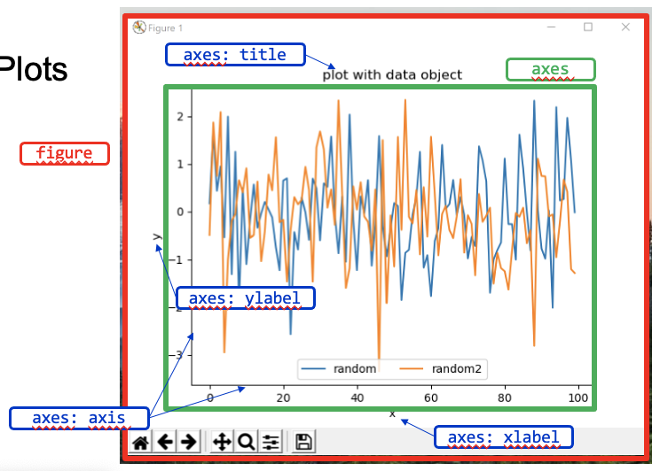
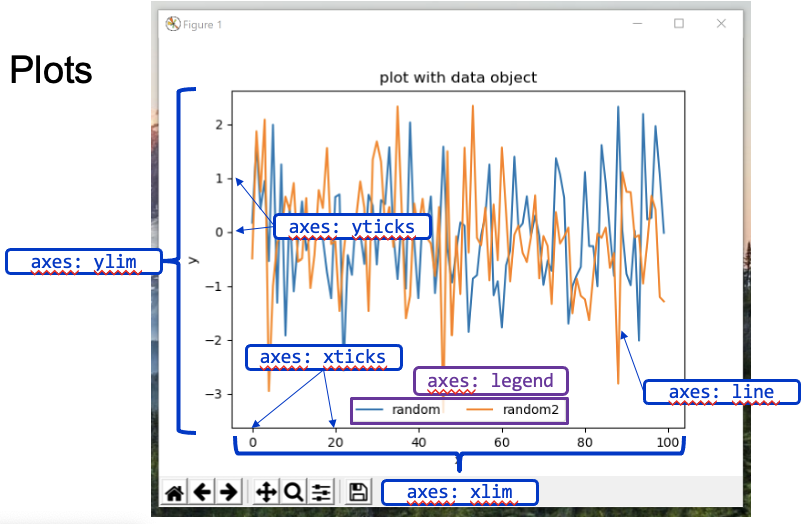

# Plots

Plots in Python, created with libraries like `matplotlib`, are essential for visualizing data. This guide covers the fundamental components of plotting, including figures, axes, and customization options like styles and legends.

Here's an overview about possible variations when creating plots.




## Figure

A **Figure** is the overall container for one or more plots in `matplotlib`. It can hold multiple axes, where each individual plot resides. You can create a figure using `plt.figure()` and specify properties like size and resolution.

```python
import matplotlib.pyplot as plt

# Create a figure with default size
fig = plt.figure()
```

## Axes

An **Axes** is a single plot within a figure, where the actual data visualization happens. You can use `fig.gca()` to get the current axes or add new axes to the figure.

```python
import numpy as np

# Create a figure and an axes
fig = plt.figure()
ax = fig.gca()  # Get the current axes

# Plot data on the axes
ax.plot([1, 2, 3, 4], [1, 4, 9, 16])
ax.set_xlabel('X')  # Set the x-axis label
ax.set_ylabel('Y')  # Set the y-axis label
ax.set_title('Simple plot')  # Set the plot title

plt.show()
```

### Subplots

Subplots allow you to create multiple plots within a single figure, useful for comparing different data visualizations side-by-side.

```python
# Create a figure with two subplots
fig, (ax1, ax2) = plt.subplots(1, 2, figsize=(10, 4))
ax1.plot([1, 2, 3], [1, 4, 9], label="Data 1")
ax2.plot([1, 2, 3], [2, 5, 10], label="Data 2")
ax1.set_title('Plot 1')
ax2.set_title('Plot 2')
plt.show()
```

## Styles

Styles define the appearance of the plot, including color, line styles, and markers. On this link, you can find everything about styles:
 
 https://matplotlib.org/3.1.1/api/_as_gen/matplotlib.pyplot.plot.html 


```python
# Example of styling lines
fig = plt.figure()
ax = fig.gca()
ax.plot([1, 1, 1, 1], 'r-')    # Red solid line
ax.plot([2, 2, 2, 2], 'g--')   # Green dashed line
ax.plot([3, 3, 3, 3], 'b+-.')  # Blue dash-dot line with plus markers
ax.plot([4, 4, 4, 4], 'yo--')  # Yellow dashed line with circle markers
plt.show()
```

### Color

You can customize the color of lines by specifying a color name or code.

```python
ax.plot([1, 2, 3, 4], color='purple')
```

### Marker

Markers represent individual data points in a plot. You can use different shapes like `o`, `+`, or `*`.

```python
ax.plot([1, 2, 3], [1, 4, 9], marker='o') # Circle markers for points
```

## Legends

A **legend** provides context for the different elements in a plot. Use `legend()` to display it and control its position.

```python
# Adding a legend with multiple lines
fig = plt.figure()
ax = fig.gca()
ax.plot([1, 2, 3, 4], [1, 4, 9, 16], label='Data 1')
ax.plot([1, 2, 3, 4], [1, 2, 3, 4], label='Data 2')
ax.legend(loc='lower center', ncol=2)  # Two-column legend in the center
plt.show()
```

## Export

After creating a plot, you can export it to various file formats like PNG and SVG. This allows for high-quality images suitable for presentations and publications.

### File Formats

| Property  | Description                               | Example                      |
|:----------|:-----------------------------------------|:-----------------------------|
| `dpi`     | (dots per inch) Controls the resolution of the export     | `dpi=300` for high quality   |
| `figsize` | Sets dimensions of the figure in inches   | `figsize=(10, 6)` for 10x6 inches |

```python
fig = plt.figure()
ax = fig.gca()
ax.figure.set_size_inches(6.3, 3.54) # Setting figure size in inches
ax.figure.set_dpi(1000) # Setting resolution to 1000 dpi

# Exporting to PNG and SVG formats
ax.figure.savefig("plot_export.png")
ax.figure.savefig("plot_export.svg")
```


