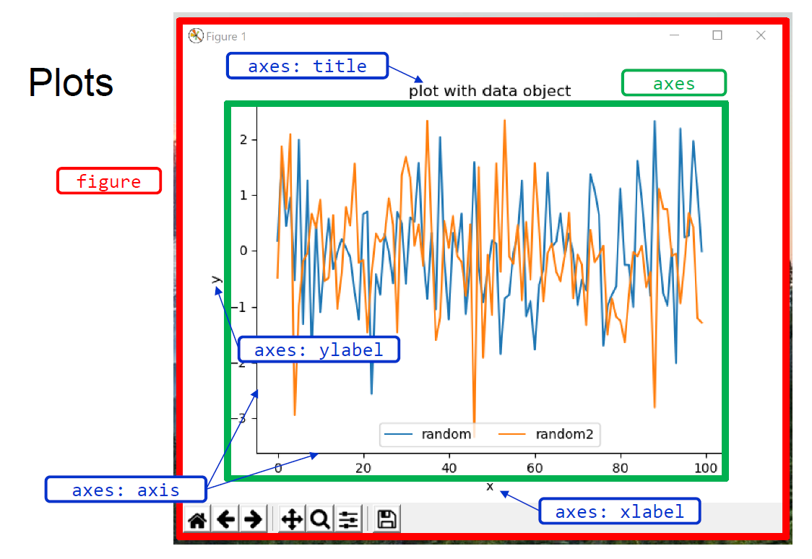

# Plots
Ziel ist es Daten die man gesammelt und eventuell bearbeitet hat zu visualisieren.
## Figure
Graphisches Fenster in dem der Plot angezeigt wird.
## Axes

Objekt in dem die Daten abgebildet werden. 

- Titel: Titel des Plots
- ylabel: Beschriftung y-Achse
- xlabel: Beschriftung x-Achse
- axis: x- und y-Achse
### Subplots

## Styles

### Farbe

### Marker

## Legenden

## Export

Fromate (png, svg)

| Eigenschaft | Beschreibung | Beispiel |
|:------------|:-------------|:---------|
| `dpi`       |              |          |
| `figsize`   |              |          |
