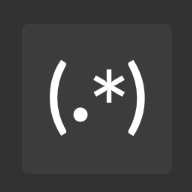

<div style="display: flex; align-items: center; margin-bottom: 20px;">
    
    <h1 style="margin: 0;">Tutorial für Regex - `re`</h1>
</div>

In diesem Tutorial werden die grundlegende Funktionsweise, einfache Funktionen und wichtige Expressionen  von Regex näher erläutert.

## 1. Import des Regex Tool

Importiert wird das Regex tool via dem Kürzel `re`

#### Beispiel

```python
import re
```


## 2. Grundlegende Funktionsweise des `re`-Moduls

Eine Regex besteht aus einer Kombination von Zeichen und Symbolen, die bestimmte Muster beschreiben. Hier wird nun ein kurzer Überblick geschaffen über die wichtigsten Bausteine des `re`-Moduls.

### Literale Zeichen

 Einzelne Zeichen werden genau so gesucht, wie sie geschrieben sind. Zum Beispiel: 

   - `re.search("Hallo", "Hallo Welt")` findet das Wort "Hallo", ein Regex (Regular Expression) aus Literalen Zeichen.


### Metazeichen

Metazeichen sind spezielle Zeichen in regulären Ausdrücken (Regex), die eine besondere Bedeutung haben und nicht einfach nur für sich selbst stehen. Sie werden verwendet, um Muster und Regeln zu definieren, nach denen in Texten gesucht wird. Mit ihnen kann man komplexe Suchmuster erstellen, die über das einfache Auffinden bestimmter Wörter hinausgehen.

Hier sind einige der wichtigsten Metazeichen in Regex und ihre Bedeutungen:


| Metazeichen | Beschreibung                                                                               | Beispiel                  |
|-------------|--------------------------------------------------------------------------------------------|---------------------------|
| `.`         | Beliebiges Zeichen außer einem Zeilenumbruch                                               | `a.b` passt auf `aab`, `acb` |
| `^`         | Anfang einer Zeichenkette                                                                  | `^Hallo` passt auf "Hallo Welt" nur am Anfang |
| `$`         | Ende einer Zeichenkette                                                                    | `Welt$` passt auf "Hallo Welt" nur am Ende |
| `\d`        | Ziffer (0–9)                                                                               | `\d+` für eine oder mehr Ziffern  |
| `\D`        | Nicht-Ziffer                                                                               | `\D+` für eine oder mehr Nicht-Ziffern |
| `\w`        | Wortzeichen (Buchstaben, Ziffern, Unterstrich)                                             | `\w+` für ein oder mehr Wortzeichen |
| `\W`        | Nicht-Wortzeichen                                                                          | `\W+` für ein oder mehr Nicht-Wortzeichen |
| `\s`        | Leerzeichen (einschließlich Leerzeichen, Tab, Zeilenumbruch)                               | `\s+` für ein oder mehr Leerzeichen |
| `\S`        | Kein Leerzeichen                                                                           | `\S+` für ein oder mehr Nicht-Leerzeichen |

### Quantifizierer

| Quantifizierer | Beschreibung                                                                      | Beispiel              |
|----------------|-----------------------------------------------------------------------------------|-----------------------|
| `*`           | Null oder mehr Wiederholungen des vorherigen Zeichens oder Musters                | `a*` passt auf ``, `a`, `aa` |
| `+`           | Ein oder mehr Wiederholungen des vorherigen Zeichens oder Musters                 | `a+` passt auf `a`, `aa`, `aaa` |
| `?`           | Null oder eine Wiederholung des vorherigen Zeichens oder Musters                  | `a?` passt auf ``, `a` |
| `{n,m}`       | Mindestens `n` und höchstens `m` Wiederholungen des vorherigen Zeichens oder Musters | `\d{2,4}` für 2 bis 4 Ziffern |

### Zeichengruppen und Alternativen

| Syntax   | Beschreibung                                                          | Beispiel                       |
|----------|-----------------------------------------------------------------------|--------------------------------|
| `[ ]`    | Zeichengruppe; spezifiziert eine Menge von Zeichen                    | `[aeiou]` passt auf jeden Vokal |
| `|`      | Logisches ODER für mehrere Ausdrücke                                  | `Hund|Katze` passt auf "Hund" oder "Katze" |

Für eine vollständige Auflistung von Regex Expressionen wäre das Cheetsheet von Mutanclan hilfreich.
[Hier der link zum Cheetsheet für Regex](https://cheatography.com/mutanclan/cheat-sheets/python-regular-expression-regex/)

## Grundlegende Funktionen in Regex

# Grundlegende Funktionen von Regex in Python

Das `re`-Modul in Python stellt eine Reihe von Funktionen bereit, die das Arbeiten mit regulären Ausdrücken (Regex) erleichtern. Hier sind die wichtigsten Funktionen, ihre Bedeutung, Anwendungsmöglichkeiten und kurze Code-Beispiele.

## 1. `re.search()`

- **Bedeutung**: Sucht nach dem ersten Vorkommen eines bestimmten Musters in einer Zeichenkette.
- **Anwendungsmöglichkeiten**: Kann verwendet werden, um zu prüfen, ob ein bestimmtes Muster (z. B. eine Zahl oder ein Wort) in einem Text vorhanden ist.

**Beispiel**:

  ```python
  import re
  
  result = re.search(r'\d+', 'Das Jahr 2023 ist hier')
  if result:
      print(result.group())  # Ausgabe: 2023
  ```

## 2. `re.findall()`

- **Bedeutung**: Findet alle Vorkommen eines Musters in einer Zeichenkette und gibt sie als Liste zurück.
- **Anwendungsmöglichkeiten**: Nützlich zum Extrahieren mehrerer übereinstimmender Muster, z. B. aller Zahlen oder E-Mail-Adressen in einem Text.

**Beispiel**:
  ```python
  import re

  text = 'Die Zahlen 2023 und 2024 sind beide Jahre.'
  numbers = re.findall(r'\d+', text)
  print(numbers)  # Ausgabe: ['2023', '2024']
  ```

## 3. `re.match()`

- **Bedeutung**: Überprüft, ob das Muster am Anfang der Zeichenkette vorkommt.
- **Anwendungsmöglichkeiten**: Ideal für Validierungen, bei denen die Zeichenkette ein bestimmtes Format am Anfang haben soll (z. B. eine bestimmte Präfix-Struktur).

**Beispiel**:
  ```python
  import re

  greeting = re.match(r'Hallo', 'Hallo Welt')
  if greeting:
      print(greeting.group())  # Ausgabe: 'Hallo'
  
  ```

## 4. `re.sub()`

- **Bedeutung**: Ersetzt alle Vorkommen eines Musters in einer Zeichenkette durch einen angegebenen Text.
- **Anwendungsmöglichkeiten**: Hilfreich bei der Datenbereinigung, z. B. beim Ersetzen sensibler Informationen wie Telefonnummern oder E-Mail-Adressen.

**Beispiel**:
  ```python
  import re

  text = 'Hallo Welt, hallo Python!'
  new_text = re.sub(r'hallo', 'Hi', text, flags=re.IGNORECASE)
  print(new_text)  # Ausgabe: 'Hi Welt, Hi Python!'
  ```


## 5. `re.split()`

- **Bedeutung**: Teilt eine Zeichenkette an jedem Vorkommen eines bestimmten Musters und gibt eine Liste der geteilten Teile zurück.
- **Anwendungsmöglichkeiten**: Praktisch, um Texte in verschiedene Abschnitte zu zerlegen, z. B. das Zerlegen eines Satzes in Wörter anhand eines bestimmten Trennzeichens.

**Beispiel**:
  ```python
  import re

  text = 'Apfel, Birne, Orange'
  fruits = re.split(r',\s*', text)
  print(fruits)  # Ausgabe: ['Apfel', 'Birne', 'Orange']
  ```

## 6. `re.compile()`

- **Bedeutung**: Erstellt ein Regex-Objekt, das wiederverwendet werden kann, um Muster effizienter zu durchsuchen.
- **Anwendungsmöglichkeiten**: Sinnvoll, wenn dasselbe Muster mehrfach in einem Programm verwendet wird, da es die Performance verbessert.

**Beispiel**:
  ```python
  import re

  pattern = re.compile(r'\d+')
  print(pattern.findall('In 2023 und 2024 gibt es Feiertage.'))  # Ausgabe: ['2023', '2024']
  ```

  ## 7. `re.fullmatch()`

- **Bedeutung**: Überprüft, ob die gesamte Zeichenkette mit dem Muster übereinstimmt.
- **Anwendungsmöglichkeiten**: Gut für exakte Musterabgleiche, z. B. das Validieren eines Formats wie einer Telefonnummer oder einer Postleitzahl.

**Beispiel**:
  ```python
  import re

  code = '12345'
  match = re.fullmatch(r'\d{5}', code)
  if match:
      print("Gültiger Code")  # Ausgabe: Gültiger Code
  else:
      print("Ungültiger Code")
  ```

## 8. `re.escape()`

- **Bedeutung**: Fügt in einem String vor allen Regex-Sonderzeichen einen Backslash ein, sodass sie als normale Zeichen interpretiert werden.
- **Anwendungsmöglichkeiten**: Hilfreich, wenn eine Zeichenkette, die Sonderzeichen enthält, als Muster verwendet werden soll, ohne dass die Zeichen eine besondere Bedeutung haben.

**Beispiel**:
  ```python
  import re

  special_string = 'Hallo (Welt)!'
  escaped_string = re.escape(special_string)
  print(escaped_string)  # Ausgabe: 'Hallo\\ \\(Welt\\)\\!'